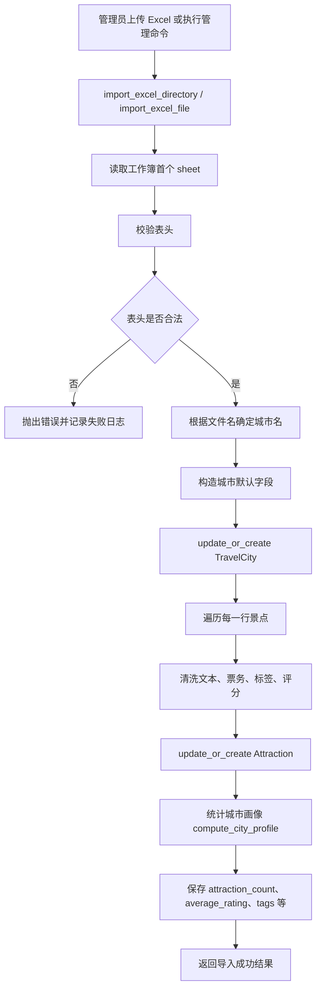
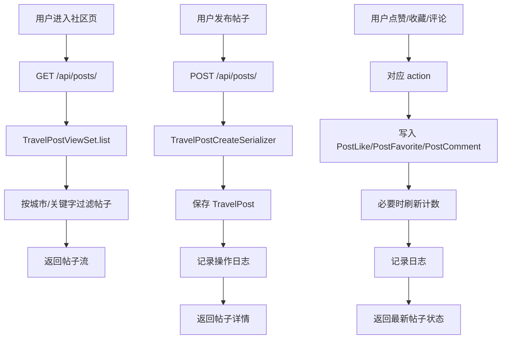
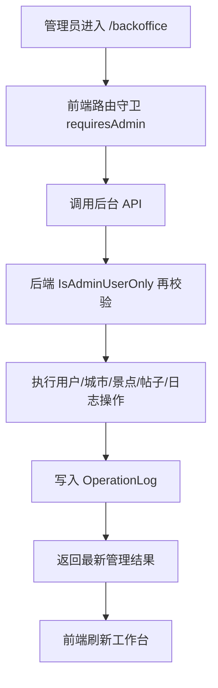

# Smart Travel 代码总览手册

## 1. 文档目标

这份文档用于解释当前仓库的真实代码结构，重点回答四个问题：

1. 项目由哪些模块组成
2. 关键代码分别放在哪里
3. 数据模型之间如何关联
4. 主要业务流程是怎么从前端走到后端、再落到数据库的

本文档以当前仓库代码为准，已经同步以下现状：

1. 旧版 `Destination` 和 `TripPlan` 已删除
2. 当前业务主模型是 `TravelCity`、`Attraction`、`TravelPlan`
3. 当前仓库不再保留 Docker 方案，文档不再解释 Docker 部署链路

---

## 2. 技术栈与总体结构

### 2.1 技术栈

- 后端：`Django 5`
- API：`Django REST Framework`
- 前端：`Vue 3 + Vue Router + Axios`
- 构建工具：`Vite`
- 数据库：`MySQL`
- 用户认证：`TokenAuthentication`
- 文件存储：`阿里云 OSS`
- 地图天气：`高德开放平台`
- AI 行程：`通义千问兼容 OpenAI 接口`

### 2.2 仓库结构

```text
smart_travel/
├─ backend/
│  ├─ apps/
│  │  ├─ backoffice/
│  │  ├─ community/
│  │  ├─ core/
│  │  ├─ destinations/
│  │  ├─ planner/
│  │  └─ users/
│  ├─ smart_travel/
│  ├─ manage.py
│  ├─ requirements.txt
│  └─ .env.example
├─ frontend/
│  ├─ src/
│  │  ├─ components/
│  │  ├─ router/
│  │  ├─ services/
│  │  ├─ stores/
│  │  └─ views/
│  ├─ package.json
│  └─ vite.config.js
├─ scripts/
│  └─ deploy_server.py
└─ docs/
```

### 2.3 代码分层思路

这个项目不是按“所有代码堆在一个 app”来组织，而是按业务领域拆分：

| 模块 | 职责 |
| --- | --- |
| `users` | 注册、登录、登出、当前用户、个人资料、上传接口 |
| `destinations` | 首页概览、城市、景点、天气、静态地图、Excel 导入 |
| `planner` | AI 行程生成与已保存行程 |
| `community` | 社区帖子、点赞、收藏、评论 |
| `backoffice` | 后台管理、统计总览、Excel 导入管理 |
| `core` | 日志、权限、标签清洗、上传能力、兼容导出 |

这种拆法的好处是：

1. 每个 app 的职责清晰
2. 业务边界明显
3. 后续扩展新功能时不容易把逻辑堆乱

---

## 3. 后端代码结构详解

## 3.1 项目入口层

### `backend/smart_travel/settings.py`

这是后端配置中心，负责：

1. 读取 `backend/.env`
2. 配置数据库连接
3. 配置 Django 已安装应用
4. 配置 CORS
5. 配置 DRF
6. 配置 OSS / 高德 / LLM 环境变量

它决定了整个系统运行环境。

### `backend/smart_travel/urls.py`

这是全局 API 路由入口：

- `/site-admin/` -> Django Admin
- `/api/` -> `users`
- `/api/` -> `destinations`
- `/api/` -> `planner`
- `/api/` -> `community`
- `/api/backoffice/` -> `backoffice`

这意味着：

1. 用户、目的地、行程、社区共享同一个 `/api`
2. 后台管理 API 单独前缀为 `/api/backoffice`

### `backend/manage.py`

用于执行 Django 命令：

- `runserver`
- `migrate`
- `check`
- `import_city_excels`

---

## 3.2 `users` 模块

### 作用

负责用户身份和个人资料。

### 核心文件

| 文件 | 说明 |
| --- | --- |
| `backend/apps/users/views.py` | 用户接口主入口 |
| `backend/apps/users/models.py` | `UserProfile` 模型 |
| `backend/apps/users/serializers.py` | 注册、登录、个人资料序列化 |
| `backend/apps/users/services.py` | 用户资料补全与用户信息序列化 |
| `backend/apps/users/urls.py` | 用户路由 |

### 关键能力

1. 注册账号并签发 token
2. 登录并返回用户摘要
3. 登出并销毁 token
4. 获取当前用户
5. 读写个人资料
6. 上传头像或附件

### 代码阅读顺序建议

1. `urls.py`
2. `views.py`
3. `serializers.py`
4. `services.py`
5. `models.py`

---

## 3.3 `destinations` 模块

### 作用

负责城市、景点、首页推荐、Excel 导入、地图天气等能力。

### 核心文件

| 文件 | 说明 |
| --- | --- |
| `backend/apps/destinations/models.py` | 城市、景点、地理缓存模型 |
| `backend/apps/destinations/views.py` | 首页、城市、景点接口 |
| `backend/apps/destinations/serializers.py` | 城市与景点序列化 |
| `backend/apps/destinations/importers.py` | Excel 导入核心逻辑 |
| `backend/apps/destinations/home_recommendations.py` | 首页推荐与个性化排序 |
| `backend/apps/destinations/amap.py` | 高德天气和静态地图 |
| `backend/apps/destinations/services.py` | 文本清洗、标签推导、城市画像计算 |
| `backend/apps/destinations/urls.py` | 目的地路由 |

### 关键能力

1. 首页总览接口 `GET /api/overview/`
2. 城市列表和城市详情
3. 景点列表和景点详情
4. AI 规划前的城市推荐
5. 高德天气和静态地图
6. Excel 批量入库

### 特别说明

这个模块是全项目的内容中心。`TravelCity` 和 `Attraction` 的质量会直接影响：

1. 首页推荐质量
2. 城市详情页内容完整度
3. AI 行程可用性
4. 后台统计数据是否可信

---

## 3.4 `planner` 模块

### 作用

负责 AI 行程生成和保存。

### 核心文件

| 文件 | 说明 |
| --- | --- |
| `backend/apps/planner/models.py` | `TravelPlan` 模型 |
| `backend/apps/planner/views.py` | 行程 API 入口 |
| `backend/apps/planner/serializers.py` | 行程序列化 |
| `backend/apps/planner/services.py` | AI 行程主逻辑 |
| `backend/apps/planner/urls.py` | 行程路由 |

### 关键能力

1. 根据目标城市和偏好生成行程
2. 支持 LLM 生成
3. 在 LLM 不可用时自动回退规则规划
4. 用户登录时可保存行程到数据库

### 核心设计点

这个模块最重要的设计不是“调用大模型”，而是“有稳定兜底”：

1. 先解析目标城市
2. 选出推荐城市和景点池
3. 尝试调用 LLM
4. 若失败则使用规则规划
5. 永远返回结构稳定的前端可消费结果

---

## 3.5 `community` 模块

### 作用

负责社区内容和互动行为。

### 核心文件

| 文件 | 说明 |
| --- | --- |
| `backend/apps/community/models.py` | 帖子、点赞、收藏、评论模型 |
| `backend/apps/community/views.py` | 社区 API 入口 |
| `backend/apps/community/serializers.py` | 帖子和评论序列化 |
| `backend/apps/community/services.py` | 计数刷新等辅助逻辑 |
| `backend/apps/community/urls.py` | 社区路由 |

### 关键能力

1. 获取帖子流
2. 查看帖子详情
3. 发布帖子
4. 点赞
5. 收藏
6. 评论与回复

### 设计特点

帖子可以同时关联：

1. 城市
2. 景点

这样可以让社区内容和主内容库互相导流。

---

## 3.6 `backoffice` 模块

### 作用

负责后台管理 API，而不是仅依赖 Django Admin。

### 核心文件

| 文件 | 说明 |
| --- | --- |
| `backend/apps/backoffice/views.py` | 后台管理主逻辑 |
| `backend/apps/backoffice/serializers.py` | 后台管理序列化 |
| `backend/apps/backoffice/models.py` | 当前主要是 `OperationLog` 导出 |
| `backend/apps/backoffice/urls.py` | 后台管理路由 |

### 后台支持的能力

1. 后台首页统计
2. 用户管理
3. 城市管理
4. 景点管理
5. 帖子管理
6. 日志查询
7. Excel 目录导入
8. Excel 上传导入

### 与 Django Admin 的关系

这个项目同时保留：

1. `/site-admin/` -> Django Admin
2. `/backoffice` -> 自定义后台前端

其中真正面向业务演示和使用的是自定义后台前端。

---

## 3.7 `core` 模块

### 作用

提供跨模块共用能力。

### 核心文件

| 文件 | 说明 |
| --- | --- |
| `backend/apps/core/activity.py` | 操作日志写入 |
| `backend/apps/core/media_utils.py` | OSS 上传 |
| `backend/apps/core/permissions.py` | 自定义权限 |
| `backend/apps/core/tagging.py` | 标签清洗 |
| `backend/apps/core/models.py` | 兼容导出 |

### 为什么它重要

业务模块看起来分散，但它们都依赖 `core`：

1. 发帖、导入、上传都会写日志
2. 后台和用户模块都依赖上传能力
3. 社区和后台依赖权限控制
4. Excel 导入依赖标签清洗

---

## 4. 前端代码结构详解

## 4.1 前端入口层

### `frontend/src/main.js`

作用：

1. 启动应用
2. 如果本地有 token，就先请求 `/api/auth/me/`
3. 再挂载 Vue

### `frontend/src/App.vue`

作用：

1. 按路由切换前台布局与后台布局
2. 前台显示头部导航
3. 后台显示工作台侧边栏和顶部栏
4. 统一页面切换动画

### `frontend/src/router/index.js`

作用：

1. 定义页面路由
2. 做前端登录校验
3. 做前端管理员校验

### `frontend/src/services/api.js`

作用：

1. 所有 API 请求的唯一入口
2. 统一封装鉴权 token
3. 统一处理 401
4. 把前端页面与后端接口解耦

---

## 4.2 页面层

### 用户侧页面

| 页面 | 路径 | 作用 |
| --- | --- | --- |
| `HomeView.vue` | `/` | 首页概览 |
| `CityListView.vue` | `/cities` | 城市列表 |
| `CityDetailView.vue` | `/cities/:id` | 城市详情 |
| `AttractionListView.vue` | `/attractions` | 景点列表 |
| `AttractionDetailView.vue` | `/attractions/:id` | 景点详情 |
| `PlannerView.vue` | `/planner` | AI 行程页 |
| `CommunityView.vue` | `/community` | 社区页 |
| `PostDetailView.vue` | `/community/:id` | 帖子详情 |
| `LoginView.vue` | `/login` | 登录 |
| `RegisterView.vue` | `/register` | 注册 |
| `ProfileView.vue` | `/profile` | 个人主页 |

### 管理侧页面

| 页面 | 路径 | 作用 |
| --- | --- | --- |
| `AdminView.vue` | `/backoffice` | 自定义后台工作台 |

---

## 4.3 组件层

前端组件主要分四类：

1. 通用展示组件
2. 内容卡片组件
3. 后台工作台组件
4. 认证和社区专用组件

代表组件如下：

| 文件 | 作用 |
| --- | --- |
| `CityCard.vue` | 城市卡片 |
| `AttractionCard.vue` | 景点卡片 |
| `PostCard.vue` | 帖子卡片 |
| `FileUploadField.vue` | 统一上传组件 |
| `SectionHeader.vue` | 页面区块标题 |
| `BackofficeSidebar.vue` | 后台侧边栏 |
| `BackofficeHeader.vue` | 后台顶部栏 |

---

## 5. 数据库设计

## 5.1 设计原则

数据库设计遵循以下原则：

1. 用户认证沿用 Django 默认表
2. 用户扩展资料单独拆表
3. 城市和景点采用一对多
4. 社区内容与城市、景点建立关联
5. 行程记录与用户、城市建立关联
6. 点赞与收藏使用独立关系表
7. 评论支持父子回复结构
8. 地理位置缓存独立建表，减少第三方重复请求

## 5.2 当前业务主表

| 表 | 模型 | 说明 |
| --- | --- | --- |
| `auth_user` | Django 内置 | 用户主表 |
| `authtoken_token` | DRF Token | Token 认证 |
| `core_userprofile` | `UserProfile` | 用户扩展资料 |
| `core_travelcity` | `TravelCity` | 城市主表 |
| `core_attraction` | `Attraction` | 景点主表 |
| `core_travelcitygeocache` | `TravelCityGeoCache` | 高德地理缓存 |
| `core_travelplan` | `TravelPlan` | 已保存行程 |
| `core_travelpost` | `TravelPost` | 社区帖子 |
| `core_postlike` | `PostLike` | 点赞关系 |
| `core_postfavorite` | `PostFavorite` | 收藏关系 |
| `core_postcomment` | `PostComment` | 评论关系 |
| `core_operationlog` | `OperationLog` | 审计日志 |

## 5.3 关键关系说明

1. 一个用户对应一个 `UserProfile`
2. 一个城市对应多个景点
3. 一个城市对应一个地理缓存
4. 一个用户可以保存多个 AI 行程
5. 一个帖子可以关联一个城市，也可以进一步关联一个景点
6. 一个帖子可以有多个点赞、收藏和评论
7. 一个评论可以有多个子回复

## 5.4 ER 图

```mermaid
erDiagram
    AUTH_USER ||--|| USER_PROFILE : has
    AUTH_USER ||--o{ AUTH_TOKEN : owns
    AUTH_USER ||--o{ TRAVEL_PLAN : creates
    AUTH_USER ||--o{ TRAVEL_POST : writes
    AUTH_USER ||--o{ POST_COMMENT : writes
    AUTH_USER ||--o{ POST_LIKE : creates
    AUTH_USER ||--o{ POST_FAVORITE : creates
    AUTH_USER ||--o{ OPERATION_LOG : triggers

    TRAVEL_CITY ||--o{ ATTRACTION : contains
    TRAVEL_CITY ||--|| TRAVEL_CITY_GEO_CACHE : caches
    TRAVEL_CITY ||--o{ TRAVEL_PLAN : targets
    TRAVEL_CITY ||--o{ TRAVEL_POST : relates
    TRAVEL_CITY ||--o{ USER_PROFILE : home_city_ref

    ATTRACTION ||--o{ TRAVEL_POST : relates

    TRAVEL_POST ||--o{ POST_COMMENT : has
    TRAVEL_POST ||--o{ POST_LIKE : has
    TRAVEL_POST ||--o{ POST_FAVORITE : has
    POST_COMMENT ||--o{ POST_COMMENT : replies

    AUTH_USER {
        bigint id PK
        string username
        string email
        bool is_staff
        bool is_active
    }

    AUTH_TOKEN {
        string key PK
        bigint user_id FK
    }

    USER_PROFILE {
        bigint id PK
        bigint user_id FK
        string nickname
        string avatar_url
        string home_city
        bigint home_city_ref_id FK
        json favorite_styles
    }

    TRAVEL_CITY {
        bigint id PK
        string name
        string province
        string destination_type
        string short_intro
        text overview
        decimal average_rating
        int attraction_count
        json tags
        bool is_featured
    }

    TRAVEL_CITY_GEO_CACHE {
        bigint id PK
        bigint city_id FK
        string location
        decimal longitude
        decimal latitude
        string adcode
        string citycode
        string city_name
    }

    ATTRACTION {
        bigint id PK
        bigint city_id FK
        string name
        text address
        text description
        decimal rating
        string suggested_play_time
        text ticket_info
        json tags
    }

    TRAVEL_PLAN {
        bigint id PK
        bigint user_id FK
        bigint city_id FK
        string title
        string departure_city
        int duration_days
        string budget_level
        string companions
        json interests
        json itinerary
        int estimated_budget
        string status
    }

    TRAVEL_POST {
        bigint id PK
        bigint author_id FK
        bigint city_id FK
        bigint attraction_id FK
        string title
        text content
        string cover_image
        json tags
        int likes_count
        int views_count
        string status
    }

    POST_LIKE {
        bigint id PK
        bigint post_id FK
        bigint user_id FK
    }

    POST_FAVORITE {
        bigint id PK
        bigint post_id FK
        bigint user_id FK
    }

    POST_COMMENT {
        bigint id PK
        bigint post_id FK
        bigint author_id FK
        bigint parent_id FK
        text content
    }

    OPERATION_LOG {
        bigint id PK
        bigint user_id FK
        string category
        string action
        string status
        string target_type
        bigint target_id
        string request_path
    }
```



---

## 6. 关键业务流程图

## 6.1 首页加载流程

```mermaid
flowchart TD
    A[用户访问首页] --> B[前端 HomeView mounted]
    B --> C[调用 getOverview]
    C --> D[GET /api/overview/]
    D --> E[HomeOverviewAPIView]
    E --> F[build_home_payload(user)]
    F --> G[读取用户常住城市和偏好]
    G --> H[计算省份卡片]
    G --> I[计算推荐城市]
    G --> J[计算推荐景点]
    G --> K[获取最新帖子]
    H --> L[序列化返回 JSON]
    I --> L
    J --> L
    K --> L
    L --> M[前端渲染首页各区块]
```

## 6.2 Excel 导入流程



## 6.3 AI 行程生成流程

```mermaid
flowchart TD
    A[用户填写行程参数] --> B[POST /api/planner/generate/]
    B --> C[PlannerGenerateAPIView]
    C --> D[build_ai_plan(payload)]
    D --> E[resolve_target_city]
    E --> F{是否找到目标城市}
    F -- 否 --> G[按兴趣和预算推荐城市]
    F -- 是 --> H[构造目标城市相关推荐]
    G --> I[选择主城市]
    H --> I
    I --> J[尝试 generate_itinerary_with_llm]
    J --> K{LLM 是否成功}
    K -- 是 --> L[normalize_llm_itinerary]
    K -- 否 --> M[build_plan_itinerary 规则规划]
    L --> N[计算预算和必去景点]
    M --> N
    N --> O{用户是否登录且要求保存}
    O -- 是 --> P[创建 TravelPlan]
    O -- 否 --> Q[仅返回结果]
    P --> R[写入操作日志]
    Q --> R
    R --> S[前端展示逐日行程]
```

## 6.4 社区互动流程



## 6.5 后台管理流程



---

## 7. 请求路径与代码定位

## 7.1 前端到后端请求路径

```mermaid
flowchart LR
    A[Vue View] --> B[services/api.js]
    B --> C[Axios Client]
    C --> D[/api/...]
    D --> E[Django URLConf]
    E --> F[APIView / ViewSet]
    F --> G[Serializer / Service]
    G --> H[Model / MySQL]
```

## 7.2 前端开发时的代理路径

```mermaid
flowchart LR
    A[Vite Dev Server :5173] --> B[/api]
    B --> C[Vite Proxy]
    C --> D[Django :8000]
```

生产环境则由 Nginx 完成这层转发。

---

## 8. 关键代码阅读顺序

如果是第一次接手项目，建议按这个顺序读代码：

1. `backend/smart_travel/settings.py`
2. `backend/smart_travel/urls.py`
3. `backend/apps/destinations/models.py`
4. `backend/apps/planner/models.py`
5. `backend/apps/community/models.py`
6. `backend/apps/users/models.py`
7. `backend/apps/destinations/views.py`
8. `backend/apps/planner/views.py`
9. `backend/apps/community/views.py`
10. `backend/apps/backoffice/views.py`
11. `backend/apps/destinations/importers.py`
12. `backend/apps/planner/services.py`
13. `frontend/src/services/api.js`
14. `frontend/src/router/index.js`
15. `frontend/src/views/HomeView.vue`
16. `frontend/src/views/PlannerView.vue`
17. `frontend/src/views/AdminView.vue`

这样读的原因是：

1. 先理解配置与路由
2. 再理解数据模型
3. 再进入业务逻辑
4. 最后看页面如何消费这些接口

---

## 9. 关键文件索引

### 后端

- `backend/smart_travel/settings.py`
- `backend/smart_travel/urls.py`
- `backend/apps/destinations/models.py`
- `backend/apps/destinations/views.py`
- `backend/apps/destinations/importers.py`
- `backend/apps/destinations/home_recommendations.py`
- `backend/apps/destinations/amap.py`
- `backend/apps/planner/models.py`
- `backend/apps/planner/views.py`
- `backend/apps/planner/services.py`
- `backend/apps/community/models.py`
- `backend/apps/community/views.py`
- `backend/apps/backoffice/views.py`
- `backend/apps/core/activity.py`
- `backend/apps/core/media_utils.py`

### 前端

- `frontend/src/main.js`
- `frontend/src/App.vue`
- `frontend/src/router/index.js`
- `frontend/src/services/api.js`
- `frontend/src/stores/auth.js`
- `frontend/src/views/HomeView.vue`
- `frontend/src/views/PlannerView.vue`
- `frontend/src/views/CommunityView.vue`
- `frontend/src/views/AdminView.vue`

### 运维

- `scripts/deploy_server.py`

---

## 10. 当前版本重点结论

1. 项目已经形成“内容库 + AI 规划 + 社区 + 后台 + 部署”的完整闭环
2. 数据主线围绕 `TravelCity -> Attraction -> TravelPlan / TravelPost`
3. AI 规划依赖真实景点数据，而不是脱离内容库单独生成文案
4. 后台不是摆设，已经能直接改用户、城市、景点和帖子
5. 上传、天气、地图和大模型都依赖外部服务，所以环境变量配置非常关键

如果只保留一句话概括当前代码结构，可以这样描述：

`Smart Travel` 是一个围绕中国城市旅行内容构建的前后端分离平台，后端按业务模块拆分，前端按页面和统一 API 层组织，数据库围绕城市、景点、行程、社区和用户资料展开，并通过后台与部署脚本支撑实际运行。


## 2026-03-29 Repository Update
- Backend is MySQL-only. The SQLite fallback and `settings_test.py` have been removed.
- `POST /api/auth/login/` no longer builds recommendation snapshots synchronously, so login latency is lower.
- Home recommendations now use a two-stage flow:
  1. `GET /api/overview/?mode=default` returns the fast default home ranking used for the first screen.
  2. Logged-in clients then request `GET /api/overview/?mode=personalized` and replace the default cards after the personalized result is ready.
- Recommendation snapshots persist only the top scored subset needed by the app, which reduces write time during refresh.
- Current backend regression command: `python backend/manage.py test -v 2 --noinput`
