# Smart Travel 架构与部署说明

## 1. 文档目标

这份文档关注两件事：

1. 当前系统架构是怎样组成的
2. 当前项目应该如何部署、运维和排障

本文档按当前仓库代码状态重写，已经明确同步以下事实：

1. 当前部署方案是原生部署，不是 Docker
2. 当前业务主模型是 `TravelCity`、`Attraction`、`TravelPlan`
3. 旧版 `Destination` 和 `TripPlan` 已删除

---

## 2. 系统架构总览

## 2.1 业务目标

`Smart Travel` 不是单页展示站，而是一套完整业务链路：

1. 内容采集与导入
2. 城市和景点展示
3. AI 行程生成
4. 用户账户与资料
5. 旅行社区互动
6. 后台管理和审计

## 2.2 技术架构图

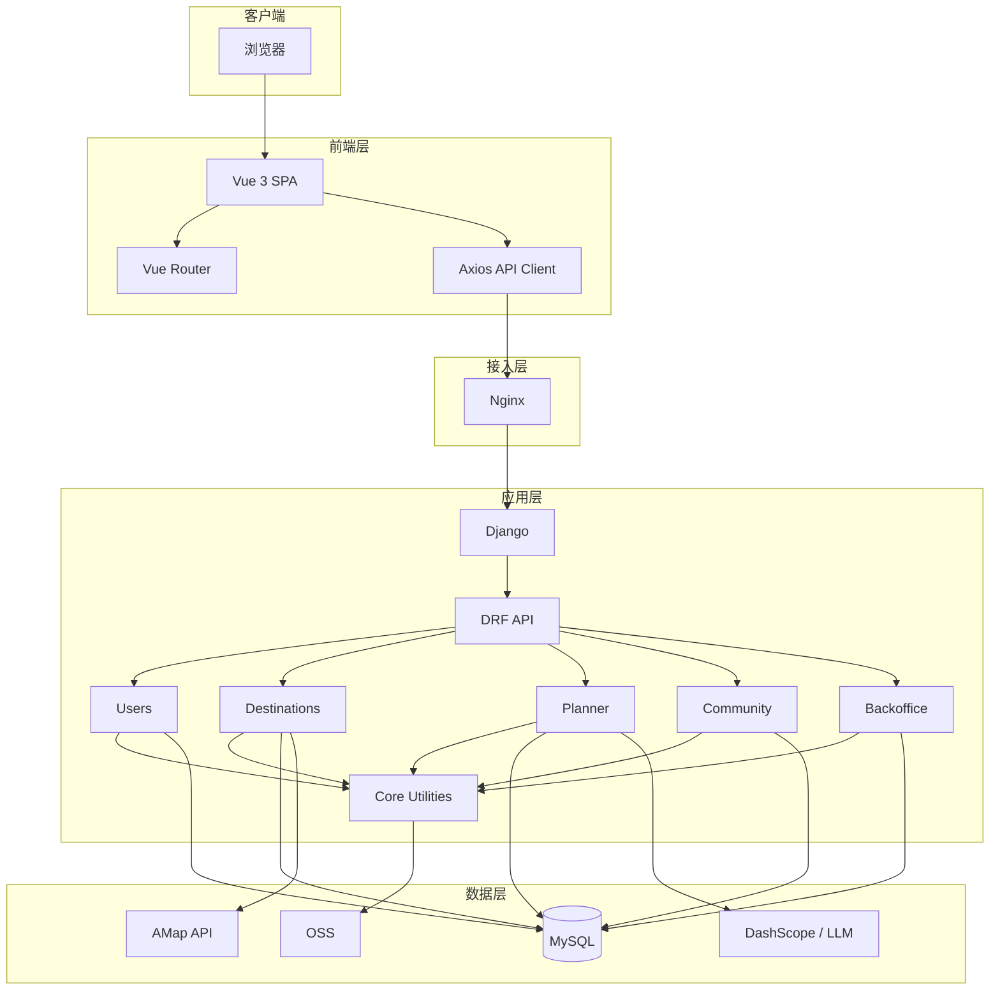

---

## 3. 逻辑架构分层

## 3.1 表现层

表现层由 Vue 前端组成，负责：

1. 页面展示
2. 路由切换
3. 本地 token 状态维护
4. API 请求发起

关键文件：

- `frontend/src/main.js`
- `frontend/src/App.vue`
- `frontend/src/router/index.js`
- `frontend/src/services/api.js`

## 3.2 接入层

接入层在开发和生产环境下分别由不同组件承担：

### 开发环境

- `Vite` 负责前端开发服务
- `vite.config.js` 把 `/api` 代理到 Django

### 生产环境

- `Nginx` 负责：
  - 返回前端静态资源
  - 把 `/api/` 反代给 Gunicorn
  - 把 `/site-admin/` 反代给 Gunicorn

## 3.3 应用层

应用层由 Django + DRF 组成，核心模块如下：

| 模块 | 职责 |
| --- | --- |
| `users` | 认证、资料、上传 |
| `destinations` | 城市、景点、首页、天气、静态地图、Excel 导入 |
| `planner` | AI 行程生成与保存 |
| `community` | 社区互动 |
| `backoffice` | 后台管理 |
| `core` | 权限、日志、标签、上传能力 |

## 3.4 数据层

数据层由四部分组成：

1. `MySQL`：核心业务数据
2. `OSS`：图片与上传文件
3. `高德 API`：天气和静态地图
4. `DashScope / LLM`：AI 行程生成

---

## 4. 核心架构设计说明

## 4.1 为什么前后端分离

选择前后端分离的原因：

1. 前端页面交互复杂，适合 SPA
2. 后端更专注 API 与数据逻辑
3. 便于未来替换前端样式或单独扩展移动端

## 4.2 为什么按业务 app 拆分

没有把所有逻辑放在一个 `core` app 里，而是拆分成多个领域模块，原因是：

1. 业务边界更清晰
2. API 职责更明确
3. 代码规模增大后更容易维护

## 4.3 为什么模型仍沿用 `core_*` 表名

虽然模型代码已经分散到多个 app，但它们仍设置：

```python
app_label = "core"
```

这样做的目的：

1. 保持历史表名稳定
2. 避免大规模重建迁移
3. 降低数据库结构重构风险

## 4.4 为什么 AI 行程必须有规则兜底

这是架构上非常重要的决策。

如果只依赖大模型，系统会在以下情况直接不可用：

1. API key 缺失
2. 网络超时
3. 大模型响应格式错误
4. 第三方服务限流

当前做法是：

1. 优先用 LLM
2. 失败后自动回退规则规划
3. 始终返回前端能识别的统一结构

这使得系统的可用性明显高于“纯调用大模型”方案。

---

## 5. 数据架构

## 5.1 核心实体关系图

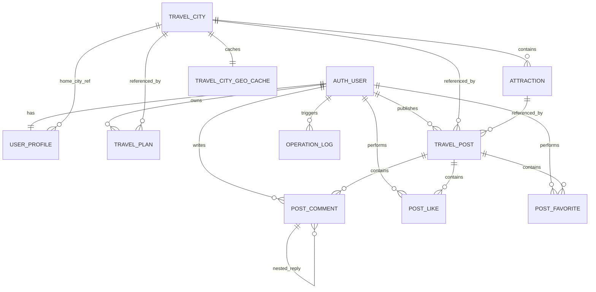

## 5.2 数据主链路

整个系统的数据主链路可以概括为：

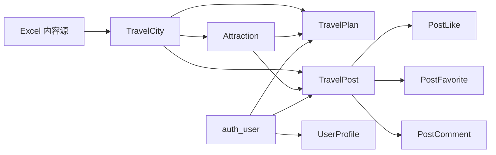

---

## 6. 关键运行流程

## 6.1 页面请求流程

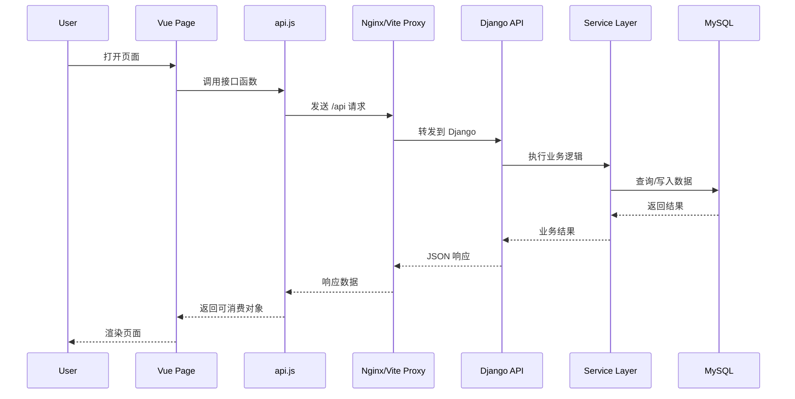

## 6.2 登录流程

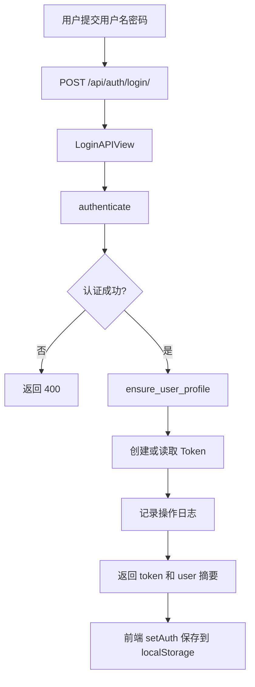

## 6.3 首页推荐流程

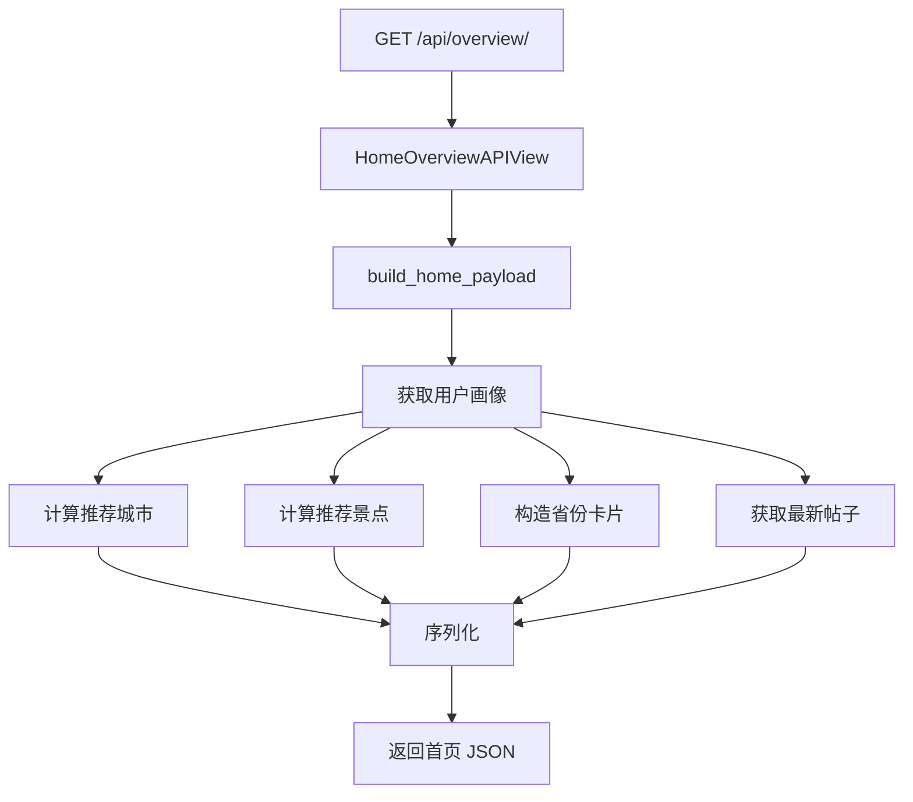

## 6.4 Excel 导入流程

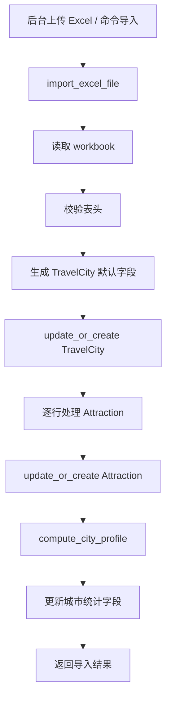

## 6.5 AI 行程流程

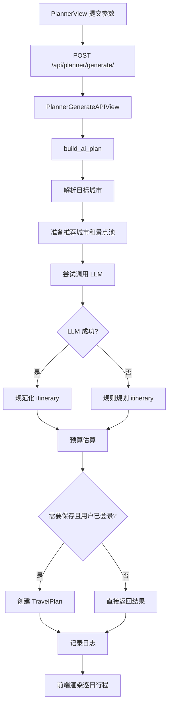

## 6.6 社区互动流程

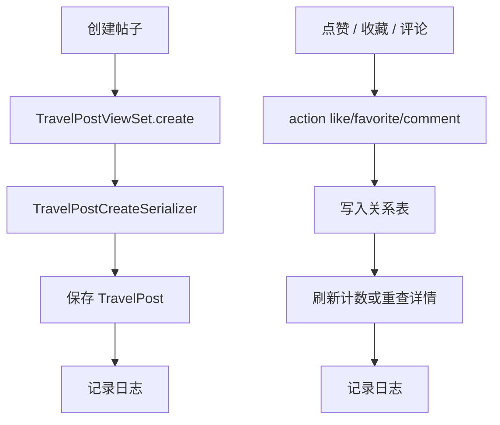

## 6.7 后台工作台流程

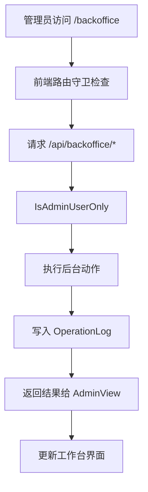

---

## 7. 部署拓扑

## 7.1 当前生产部署拓扑

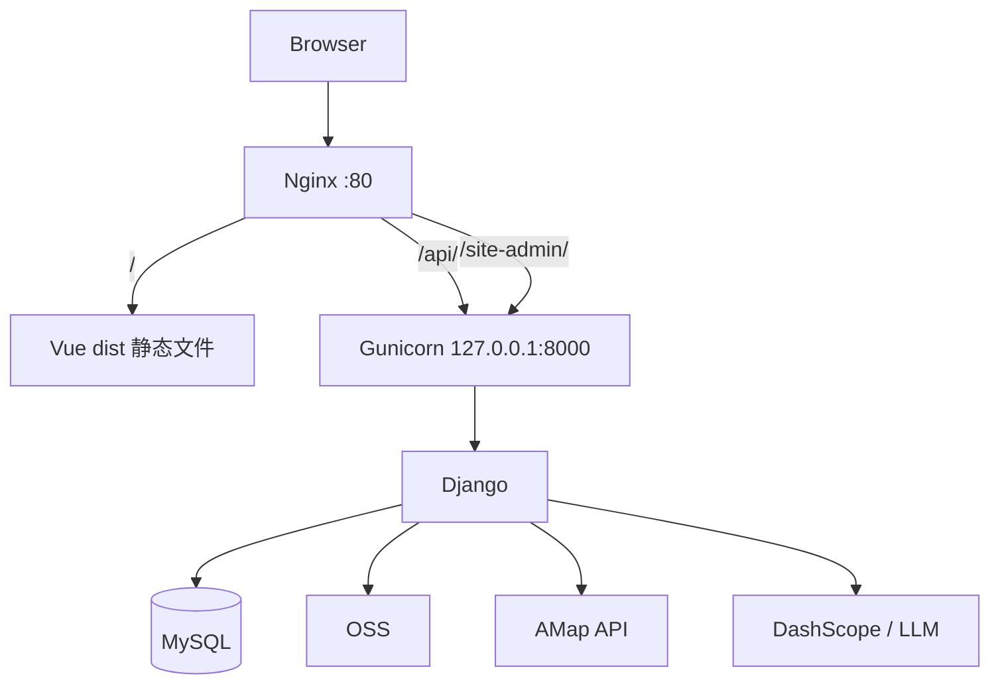

## 7.2 为什么保留这种部署方式

当前架构选择原生部署而非容器化，原因是：

1. 系统规模不大，原生部署更直接
2. 前端天然适合静态文件托管
3. Django 与 Gunicorn + Nginx 组合成熟稳定
4. 部署脚本已经覆盖安装、上传、数据库重建和服务启动

---

## 8. 部署步骤说明

## 8.1 部署前准备

需要准备：

1. Ubuntu 服务器
2. root 或有 sudo 的用户
3. 项目压缩包
4. MySQL dump
5. 本地 `.env` 中的第三方密钥

## 8.2 当前自动部署脚本做了什么

`scripts/deploy_server.py` 负责：

1. 通过 SSH 连接服务器
2. 上传代码压缩包
3. 上传数据库备份
4. 安装 `nginx`、`mysql-server`、`python3-venv`
5. 创建应用用户
6. 解压项目到 `/srv/smart_travel`
7. 创建虚拟环境并安装依赖
8. 重建 MySQL 数据库
9. 导入数据库 dump
10. 生成远程 `.env`
11. 写入 `systemd` 服务文件
12. 写入 Nginx 站点配置
13. 执行 `migrate`
14. 执行 `collectstatic`
15. 执行 `check`
16. 启动服务并验证 HTTP 响应

## 8.3 部署流程图

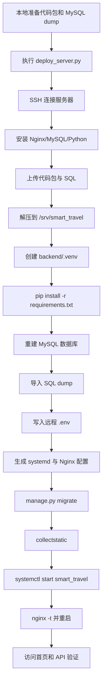

## 8.4 远程目录结构

默认部署目录：

```text
/srv/smart_travel/
├─ backend/
│  ├─ .venv/
│  ├─ .env
│  ├─ staticfiles/
│  └─ ...
├─ frontend/
│  └─ dist/
└─ ...
```

---

## 9. 配置说明

## 9.1 后端环境变量

最关键的环境变量包括：

### Django 基础

- `SECRET_KEY`
- `DEBUG`
- `ALLOWED_HOSTS`
- `CSRF_TRUSTED_ORIGINS`
- `CORS_ALLOW_ALL_ORIGINS`
- `CORS_ALLOWED_ORIGINS`

### 数据库

- `DB_ENGINE`
- `DB_NAME`
- `DB_USER`
- `DB_PASSWORD`
- `DB_HOST`
- `DB_PORT`

### 文件上传

- `OSS_ACCESS_KEY_ID`
- `OSS_ACCESS_KEY_SECRET`
- `OSS_BUCKET_NAME`
- `OSS_ENDPOINT`
- `OSS_REGION`
- `OSS_MEDIA_PREFIX`

### 地图天气

- `AMAP_API_KEY`
- `AMAP_BASE_URL`
- `AMAP_REQUEST_TIMEOUT`

### AI 行程

- `LLM_PROVIDER`
- `DASHSCOPE_API_KEY`
- `DASHSCOPE_MODEL`
- `DASHSCOPE_BASE_URL`
- `LLM_API_TIMEOUT`

## 9.2 前端配置

当前前端不依赖独立 `.env`：

1. 开发环境通过 `vite.config.js` 代理 `/api`
2. 生产环境依赖 Nginx 同域反代

这意味着前端不需要硬编码后端公网地址。

---

## 10. 数据库迁移与数据同步策略

## 10.1 当前策略

当前项目更适合“迁移结构 + 导入业务数据”或“直接迁移数据库 dump”。

实际推荐顺序：

1. 先执行 Django 迁移，保证结构完整
2. 再导入 MySQL dump，保证业务数据一致
3. 如果是空库，则可通过 Excel 重新导入城市和景点

## 10.2 数据同步流程图

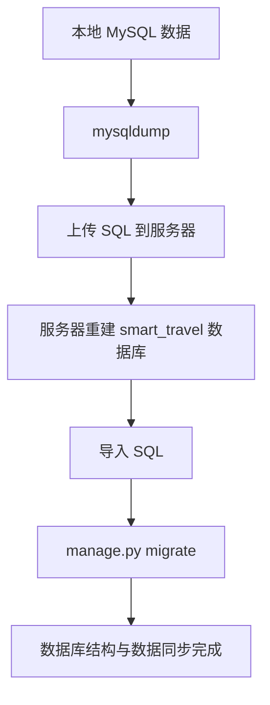

## 10.3 删除旧模型后的迁移现状

当前迁移已经包含：

- 删除 `Destination`
- 删除 `TripPlan`

对应迁移：

- `backend/apps/core/migrations/0008_remove_legacy_destination_tripplan.py`

因此部署到新环境时，不应再依赖旧表。

---

## 11. 运维说明

## 11.1 关键服务

生产环境主要关注：

1. `smart_travel.service`
2. `nginx`
3. `mysql`

## 11.2 常用命令

### 查看 Django 服务

```bash
systemctl status smart_travel
journalctl -u smart_travel -n 200 --no-pager
```

### 查看 Nginx

```bash
nginx -t
systemctl status nginx
systemctl restart nginx
```

### 查看 MySQL

```bash
systemctl status mysql
mysql -u root -p
```

### 手工执行 Django 命令

```bash
cd /srv/smart_travel/backend
./.venv/bin/python manage.py check
./.venv/bin/python manage.py migrate
./.venv/bin/python manage.py collectstatic --noinput
```

---

## 12. 风险点与排障说明

## 12.1 上传失败

现象：

- 头像上传失败
- 帖子封面上传失败
- 后台 Excel 上传失败

优先检查：

1. `OSS_*` 环境变量是否完整
2. `oss2` 是否安装
3. OSS bucket 权限是否正常

## 12.2 天气或地图失败

现象：

- `/weather/` 返回 502
- `/static-map/` 返回错误

优先检查：

1. `AMAP_API_KEY`
2. 高德接口额度
3. 城市地理缓存是否能正常解析

## 12.3 AI 行程质量下降或回退

现象：

- 总是显示规则规划
- 返回 fallback reason

优先检查：

1. `DASHSCOPE_API_KEY`
2. `DASHSCOPE_MODEL`
3. 网络连通性
4. 大模型响应格式是否异常

说明：

这不一定是故障，也可能是系统主动兜底。

## 12.4 后台无法访问

优先检查：

1. 前端用户 `is_staff`
2. 路由守卫是否通过
3. 后端 `IsAdminUserOnly` 是否拦截
4. Nginx 是否正常反代 `/api/backoffice/`

## 12.5 页面刷新后掉登录

优先检查：

1. 浏览器 `localStorage` 是否有 token
2. `/api/auth/me/` 是否返回 401
3. Token 是否已被删除

---

## 13. 安全与上线建议

## 13.1 当前必须具备的安全项

1. 生产环境 `DEBUG=False`
2. 正确配置 `ALLOWED_HOSTS`
3. 不再使用 root 作为 Django 运行用户
4. `.env` 文件权限收紧
5. 数据库使用独立应用账号

## 13.2 建议补充的安全项

1. 改成 SSH key 登录
2. 配置 HTTPS
3. 定期备份 MySQL
4. 对 OSS 上传内容做类型和大小限制
5. 为管理员账号设置更严格密码策略

---

## 14. 总结

当前系统架构可以总结为三层：

1. Vue 前端负责交互和页面组织
2. Django 负责业务逻辑和 API
3. MySQL + OSS + 高德 + LLM 共同提供数据和外部能力

当前部署架构可以总结为：

`Nginx -> Gunicorn -> Django -> MySQL`

当前架构最重要的优点有三点：

1. 模块边界清晰
2. 数据主线稳定
3. AI 能力具备规则兜底，不会因为第三方服务波动而整体失效

如果后续继续扩展，最自然的方向是：

1. 增强后台审核和统计能力
2. 优化行程推荐质量
3. 增加 HTTPS 和更完整的运维监控


## 2026-03-29 Repository Update
- Backend is MySQL-only. The SQLite fallback and `settings_test.py` have been removed.
- `POST /api/auth/login/` no longer builds recommendation snapshots synchronously, so login latency is lower.
- Home recommendations now use a two-stage flow:
  1. `GET /api/overview/?mode=default` returns the fast default home ranking used for the first screen.
  2. Logged-in clients then request `GET /api/overview/?mode=personalized` and replace the default cards after the personalized result is ready.
- Recommendation snapshots persist only the top scored subset needed by the app, which reduces write time during refresh.
- Current backend regression command: `python backend/manage.py test -v 2 --noinput`
