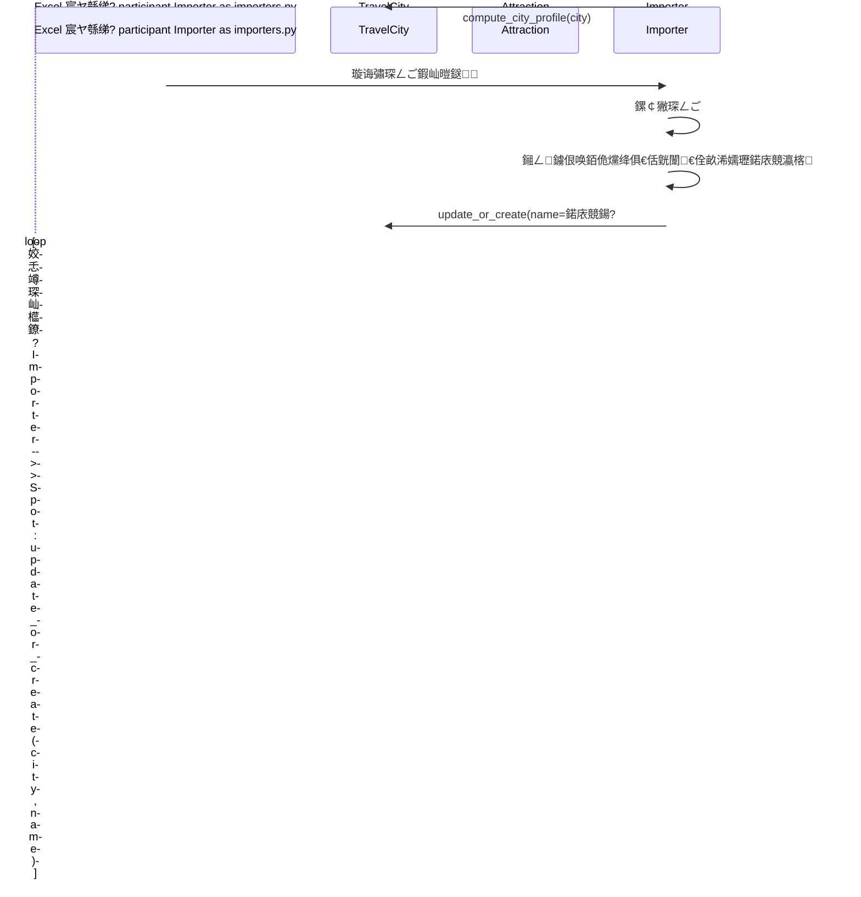
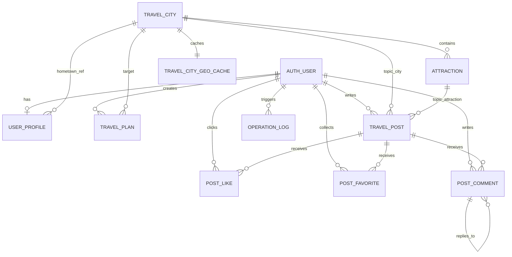

# Smart Travel 椤圭洰寮€鍙戙€佹灦鏋勪笌閮ㄧ讲璇存槑

## 1. 椤圭洰瀹氫綅

`smart_travel` 鏄竴涓洿缁曚腑鍥藉煄甯傛梾娓稿満鏅瀯寤虹殑鍓嶅悗绔垎绂婚」鐩紝鐩爣涓嶆槸鍋氶€氱敤 OTA锛岃€屾槸鎶婁竴鏉″畬鏁寸殑鈥滄暟鎹噰闆?-> 鏁版嵁鍏ュ簱 -> 鍐呭灞曠ず -> AI 瑙勫垝 -> 绀惧尯浜掑姩 -> 鍚庡彴绠＄悊 -> 绾夸笂閮ㄧ讲鈥濋摼璺仛瀹屾暣銆?
褰撳墠椤圭洰瑕嗙洊鐨勬牳蹇冭兘鍔涳細

- 鍩庡競鍒楄〃銆佸煄甯傝鎯呫€佹櫙鐐硅鎯?- AI 琛岀▼瑙勫垝涓庤绋嬩繚瀛?- 鏃呰绀惧尯鍙戝笘銆佺偣璧炪€佹敹钘忋€佽瘎璁?- 鍚庡彴鏁版嵁绠＄悊銆佹棩蹇楀璁°€丒xcel 瀵煎叆
- 楂樺痉澶╂皵 / 闈欐€佸湴鍥?- 闃块噷浜?OSS 涓婁紶
- Qwen / DashScope 澶фā鍨嬭鍒?
## 2. 鎶€鏈爤

| 灞?| 鎶€鏈?|
| --- | --- |
| 鍓嶇 | Vue 3銆乂ue Router銆丄xios銆乂ite |
| 鍚庣 | Django 5.1銆丏jango REST Framework銆乀oken Auth |
| 鏁版嵁搴?| MySQL 涓轰富锛孲QLite 浣滀负鍥為€€ |
| 鏁版嵁瀵煎叆 | openpyxl銆丒xcel 鎵归噺瀵煎叆 |
| 绗笁鏂规湇鍔?| DashScope(Qwen)銆侀珮寰峰紑鏀惧钩鍙般€侀樋閲屼簯 OSS |
| 閮ㄧ讲 | Ubuntu 24.04銆丟unicorn銆丯ginx銆乻ystemd |

## 3. 寮€鍙戞祦绋嬫€昏

```mermaid
flowchart TD
    A[闇€姹傛媶瑙 --> B[纭畾鏁版嵁鏉ユ簮: 鏈湴 Excel + 鐖櫕 Excel]
    B --> C[璁捐鏍稿績鏁版嵁妯″瀷]
    C --> D[鎸変笟鍔℃媶鍒?Django apps]
    D --> E[瀹炵幇 REST API]
    E --> F[瀹炵幇 Vue 椤甸潰涓庤矾鐢盷
    F --> G[鎺ュ叆 AI / 鍦板浘 / 涓婁紶绛夌涓夋柟鏈嶅姟]
    G --> H[鑱旇皟涓庢瀯寤洪獙璇乚
    H --> I[鐢熶骇閰嶇疆鏀舵暃]
    I --> J[閮ㄧ讲鍒?Ubuntu + Nginx + Gunicorn + MySQL]
```

鍙互鎶婅繖涓」鐩悊瑙ｄ负 6 涓繛缁樁娈碉細

1. 鏁版嵁鍑嗗锛氱‘瀹?Excel 妯℃澘銆佸鍏ラ€昏緫鍜岀埇铏緭鍑烘牸寮忋€?2. 鏁版嵁寤烘ā锛氬厛鎶婂煄甯傘€佹櫙鐐广€佺敤鎴枫€佺ぞ鍖恒€佽绋嬬瓑鏍稿績瀹炰綋寤鸿捣鏉ャ€?3. 鍚庣 API锛氭寜鐢ㄦ埛銆佺洰鐨勫湴銆佽鍒掋€佺ぞ鍖恒€佸悗鍙版媶妯″潡銆?4. 鍓嶇椤甸潰锛氬熀浜庣粺涓€ API 鎷艰鐢ㄦ埛绔笌鍚庡彴绔晫闈€?5. 绗笁鏂归泦鎴愶細鎺?OSS銆丄Map銆丏ashScope銆?6. 涓婄嚎杩愮淮锛氭妸寮€鍙戦厤缃敹鎴愮敓浜ч厤缃紝骞跺畬鎴愰儴缃层€?
## 4. 绯荤粺鏋舵瀯

```mermaid
flowchart LR
    Browser[娴忚鍣?/ Vue SPA] --> Nginx[Nginx]
    Nginx -->|闈欐€佹枃浠秥 Dist[frontend/dist]
    Nginx -->|/api /site-admin| Gunicorn[Gunicorn]
    Gunicorn --> Django[Django + DRF]
    Django --> MySQL[(MySQL)]
    Django --> OSS[闃块噷浜?OSS]
    Django --> AMap[楂樺痉澶╂皵 / 闈欐€佸湴鍥綸
    Django --> LLM[DashScope / Qwen]
```

璁捐閲嶇偣锛?
- 鍓嶇 `axios` 缁熶竴鎶?API 璇锋眰鍙戝埌鍚屽煙 `/api`
- 鐢熶骇鐜鐢?Nginx 鎵樼 Vue 鏋勫缓浜х墿
- Nginx 鍐嶆妸 `/api` 鍜?`/site-admin` 鍙嶄唬鍒?Gunicorn
- Django 鍙礋璐ｄ笟鍔?API 鍜屽悗鍙帮紝涓嶇洿鎺ユ毚闇插紑鍙戞湇鍔″櫒

杩欎篃鏄负浠€涔堝墠绔病鏈夊啓姝诲悗绔煙鍚嶏紝鑰屾槸鐢ㄧ浉瀵硅矾寰勶細

- `frontend/src/services/api.js`
- `frontend/vite.config.js`

## 5. 浠撳簱缁撴瀯

```text
smart_travel/
鈹溾攢 backend/
鈹? 鈹溾攢 apps/
鈹? 鈹? 鈹溾攢 backoffice/
鈹? 鈹? 鈹溾攢 community/
鈹? 鈹? 鈹溾攢 core/
鈹? 鈹? 鈹溾攢 destinations/
鈹? 鈹? 鈹溾攢 planner/
鈹? 鈹? 鈹斺攢 users/
鈹? 鈹溾攢 smart_travel/
鈹? 鈹溾攢 manage.py
鈹? 鈹斺攢 requirements.txt
鈹溾攢 frontend/
鈹? 鈹溾攢 public/
鈹? 鈹溾攢 src/
鈹? 鈹? 鈹溾攢 components/
鈹? 鈹? 鈹溾攢 router/
鈹? 鈹? 鈹溾攢 services/
鈹? 鈹? 鈹溾攢 stores/
鈹? 鈹? 鈹斺攢 views/
鈹溾攢 docs/
鈹斺攢 scripts/
```

## 6. 鍚庣妯″潡鎷嗗垎鎬濊矾

### 6.1 涓轰粈涔堟ā鍨嬭繕鎸傚湪 `core` app label 涓?
杩欐槸椤圭洰涓€涓緢鍏抽敭鐨勫伐绋嬪喅绛栥€?
妯″瀷浠ｇ爜鐜板湪鍒嗗埆鍐欏湪锛?
- `apps/destinations/models.py`
- `apps/users/models.py`
- `apps/planner/models.py`
- `apps/community/models.py`
- `apps/backoffice/models.py`

浣嗚繖浜涙ā鍨嬮兘淇濈暀浜嗭細

```python
CORE_APP_LABEL = "core"
```

骞跺湪 `Meta.app_label = CORE_APP_LABEL`銆?
杩欐牱鍋氱殑鐩殑锛?
1. 淇濈暀鍘嗗彶 MySQL 琛ㄥ悕锛屼緥濡?`core_travelcity`銆乣core_travelpost`
2. 閬垮厤鍥犱负鈥滄媶 app鈥濊€岄噸寤烘暟鎹簱
3. 浠ｇ爜鍒嗗眰鏇存竻鏅帮紝浣嗘暟鎹簱杩佺Щ椋庨櫓鏇翠綆

瀵瑰簲鐨勫吋瀹瑰嚭鍙ｅ湪锛?
- `backend/apps/core/models.py`

瀹冨彧鏄妸鍚勪笟鍔℃ā鍨嬮噸鏂板鍑猴紝鏂逛究鍘嗗彶瀵煎叆璺緞缁х画鍙敤銆?
### 6.2 鍚?app 鑱岃矗

| app | 浣滅敤 |
| --- | --- |
| `core` | 鍏煎妯″瀷瀵煎嚭銆佸璁℃棩蹇椼€佹爣绛惧伐鍏枫€佷笂浼犲伐鍏枫€佹潈闄愬伐鍏枫€佺鐞嗗懡浠?|
| `users` | 娉ㄥ唽銆佺櫥褰曘€佺櫥鍑恒€佷釜浜鸿祫鏂欍€佺敤鎴蜂富椤点€佷笂浼犳帴鍙?|
| `destinations` | 棣栭〉姒傝銆佸煄甯傘€佹櫙鐐广€丒xcel 瀵煎叆銆佸湴鍥惧ぉ姘斻€佸煄甯傝祫鏂欐帹瀵?|
| `planner` | AI 琛岀▼鐢熸垚銆佽鍒欓檷绾с€佷繚瀛樿绋?|
| `community` | 甯栧瓙銆佺偣璧炪€佹敹钘忋€佽瘎璁?|
| `backoffice` | 鍚庡彴缁熻銆佺敤鎴?鍩庡競/鏅偣/甯栧瓙绠＄悊銆佹搷浣滄棩蹇椼€佸悗鍙板鍏?|

## 7. 鍏抽敭鍚庣瀹炵幇

### 7.1 閰嶇疆鍏ュ彛

鏍稿績鏂囦欢锛?
- `backend/smart_travel/settings.py`
- `backend/smart_travel/urls.py`

閲嶈鐐癸細

1. 椤圭洰鍚姩鏃朵細鍏堣鍙?`backend/.env`
2. 閫氳繃 `DB_ENGINE` 鍦?MySQL / SQLite 涔嬮棿鍒囨崲
3. 閫氳繃 `DEBUG`銆乣ALLOWED_HOSTS`銆乣CORS_ALLOWED_ORIGINS` 鏀舵暃鐢熶骇閰嶇疆
4. `/site-admin/` 鎸?Django Admin
5. `/api/` 鎸傚悇涓氬姟妯″潡

### 7.2 鐢ㄦ埛涓庤璇?
鏍稿績鏂囦欢锛?
- `backend/apps/users/views.py`
- `backend/apps/users/services.py`
- `backend/apps/users/models.py`

杩欓儴鍒嗗疄鐜颁簡锛?
- `Token` 鐧诲綍鎬?- 娉ㄥ唽鍚庤嚜鍔ㄥ垱寤?`UserProfile`
- 涓汉涓婚〉鐨?`home_city` 鍜?`home_city_ref`
- 涓婁紶鎺ュ彛 `/api/uploads/`

璁捐浜偣锛?
1. `ensure_user_profile()` 淇濊瘉鐢ㄦ埛璧勬枡鏄儼鎬цˉ榻愮殑锛岃€屼笉鏄緷璧栦竴娆℃€у垵濮嬪寲銆?2. `serialize_user()` 浼氭妸涓婚〉灞曠ず鎵€闇€鐨勫瓧娈典竴娆℃€ф墦骞崇粰鍓嶇銆?
### 7.3 鍩庡競 / 鏅偣 / 棣栭〉

鏍稿績鏂囦欢锛?
- `backend/apps/destinations/views.py`
- `backend/apps/destinations/models.py`
- `backend/apps/destinations/home_recommendations.py`
- `backend/apps/destinations/services.py`

杩欓儴鍒嗚礋璐ｏ細

- 棣栭〉鎬昏 `/api/overview/`
- 鍩庡競鍒楄〃銆佸煄甯傝鎯呫€佹帹鑽愬煄甯?- 鏅偣鍒楄〃銆佹櫙鐐硅鎯?- 楂樺痉澶╂皵 `/api/cities/{id}/weather/`
- 楂樺痉闈欐€佸湴鍥?`/api/cities/{id}/static-map/`

棣栭〉鎺ㄨ崘閫昏緫涓嶆槸绠€鍗曟寜璇勫垎鎺掑簭锛岃€屾槸缁撳悎锛?
- 鍩庡競/鏅偣璇勫垎
- 鏅偣鏁伴噺
- 鐢ㄦ埛涓婚〉涓殑甯镐綇鍩庡競
- 鐢ㄦ埛鍋忓ソ鐨勬梾琛岄鏍?
### 7.4 Excel 瀵煎叆

鏍稿績鏂囦欢锛?
- `backend/apps/destinations/importers.py`
- `backend/apps/core/management/commands/import_city_excels.py`

瀵煎叆閫昏緫锛?


杩欓噷鏈€閲嶈鐨勮璁℃槸锛?
1. 鍩庡競鍚嶉粯璁ゆ潵鑷枃浠跺悕锛岃€屼笉鏄?Excel 涓崟鐙瓧娈?2. `TravelCity` 鐢?`update_or_create(name=city_name)` 鏇存柊
3. `Attraction` 鐢?`(city, name)` 浣滀负鑷劧涓婚敭鏇存柊
4. `overwrite=True` 鏃讹紝褰撳墠宸ヤ綔绨垮氨鏄鍩庡競鏅偣鐨勭湡鐩告簮

### 7.5 AI 琛岀▼瑙勫垝

鏍稿績鏂囦欢锛?
- `backend/apps/planner/views.py`
- `backend/apps/planner/services.py`
- `backend/apps/planner/models.py`

瑙勫垝娴佺▼锛?
```mermaid
sequenceDiagram
    participant FE as Planner 椤甸潰
    participant API as PlannerGenerateAPIView
    participant Service as build_ai_plan
    participant LLM as DashScope / Qwen
    participant DB as MySQL

    FE->>API: POST /api/planner/generate/
    API->>Service: build_ai_plan(payload)
    Service->>DB: 鏌ヨ鐩爣鍩庡競/鎺ㄨ崘鍩庡競/鏅偣姹?    alt 閰嶇疆浜?LLM 涓旇皟鐢ㄦ垚鍔?        Service->>LLM: 鍙戦€佺粨鏋勫寲 prompt
        LLM-->>Service: 杩斿洖 JSON itinerary
        Service->>Service: 褰掍竴鍖栦负鍓嶇鍥哄畾缁撴瀯
    else LLM 涓嶅彲鐢?/ 瑙ｆ瀽澶辫触 / 缃戠粶澶辫触
        Service->>Service: 璧拌鍒欒鍒?    end
    Service-->>API: 杩斿洖 itinerary + budget + city
    API-->>FE: JSON 鍝嶅簲
```

杩欓噷鐨勫叧閿笉鏄€滄湁澶фā鍨嬧€濓紝鑰屾槸鈥滄病鏈夊ぇ妯″瀷涔熻兘杩斿洖缁撴灉鈥濄€?
`build_ai_plan()` 鐨勭瓥鐣ユ槸锛?
1. 鍏堟壘鐩爣鍩庡競
2. 鎵句笉鍒板氨鎺ㄨ崘涓€涓渶鍚堥€傜殑鍩庡競
3. 灏濊瘯璋冪敤 LLM
4. 浠讳竴澶辫触閮介檷绾у埌瑙勫垯瑙勫垝
5. 濡傛灉鐢ㄦ埛瑕佹眰淇濆瓨锛屽啀钀戒竴浠?`TravelPlan`

杩欒 AI 鍔熻兘浠庘€滃彲閫夊寮衡€濆彉鎴愨€滀笉浼氶樆鏂富娴佺▼鈥濄€?
### 7.6 绀惧尯妯″潡

鏍稿績鏂囦欢锛?
- `backend/apps/community/views.py`
- `backend/apps/community/models.py`
- `backend/apps/community/services.py`

瀹炵幇鑳藉姏锛?
- 鍙戝笘
- 甯栧瓙璇︽儏娴忚璁℃暟
- 鐐硅禐鍒囨崲
- 鏀惰棌鍒囨崲
- 璇勮涓庡洖澶?
鏁版嵁搴撲笂鐢ㄤ袱鏉″敮涓€绾︽潫淇濊瘉閲嶅鎿嶄綔涓嶄細浜х敓鑴忔暟鎹細

- `uniq_post_like`
- `uniq_post_favorite`

### 7.7 鍚庡彴妯″潡

鏍稿績鏂囦欢锛?
- `backend/apps/backoffice/views.py`
- `backend/apps/backoffice/urls.py`
- `backend/apps/backoffice/models.py`

鍚庡彴涓昏鎵挎媴锛?
- 缁熻姹囨€?- 鐢ㄦ埛绠＄悊
- 鍩庡競 / 鏅偣 CRUD
- 甯栧瓙绠＄悊
- Excel 瀵煎叆
- 鎿嶄綔鏃ュ織鏌ヨ

杩欓噷鐨勪竴涓璁￠噸鐐规槸锛氬悗鍙颁笉鏄洿鎺ュ鐢ㄧ敤鎴风椤甸潰锛岃€屾槸鐙珛 `layout=admin` 鐨勫墠绔３灞傘€?
### 7.8 鎿嶄綔鏃ュ織

鏍稿績鏂囦欢锛?
- `backend/apps/core/activity.py`
- `backend/apps/backoffice/models.py`

`log_operation()` 鏄緢澶氳姹傜殑閫氱敤瀹¤鍏ュ彛锛岃褰曪細

- 鐢ㄦ埛
- 鍒嗙被
- 鎿嶄綔鍚?- 璇锋眰璺緞
- IP
- 鎿嶄綔瀵硅薄
- 缁嗚妭 JSON

瀹冩棦鏀寔 Django 妯″瀷瀹炰緥锛屼篃鏀寔涓婁紶鏂囦欢杩欑涓存椂 dict 瀵硅薄銆?
### 7.9 涓婁紶涓庡獟浣?
鏍稿績鏂囦欢锛?
- `backend/apps/core/media_utils.py`

褰撳墠涓婁紶閾捐矾锛?
1. 鏍￠獙鎵╁睍鍚?2. 璇诲彇浜岃繘鍒跺唴瀹?3. 涓婁紶鍒伴樋閲屼簯 OSS
4. 杩斿洖绛惧悕 URL

杩欐剰鍛崇潃涓婁紶鍔熻兘渚濊禆浠ヤ笅閰嶇疆锛?
- `OSS_ACCESS_KEY_ID`
- `OSS_ACCESS_KEY_SECRET`
- `OSS_BUCKET_NAME`
- `OSS_ENDPOINT`

### 7.10 鍦板浘涓庡ぉ姘旂紦瀛?
鏍稿績鏂囦欢锛?
- `backend/apps/destinations/amap.py`
- `backend/apps/destinations/models.py`

`TravelCityGeoCache` 鐢ㄦ潵缂撳瓨楂樺痉瑙ｆ瀽鍑虹殑锛?
- 缁忕含搴?- `adcode`
- `citycode`
- 瑙勮寖鍦板潃

浣滅敤鏄伩鍏嶆瘡娆℃煡澶╂皵閮介噸鏂板仛涓€娆″湴鐞嗙紪鐮併€?
## 8. 鍓嶇缁撴瀯

### 8.1 鍓嶇澹冲眰

鏍稿績鏂囦欢锛?
- `frontend/src/App.vue`

璁捐瑕佺偣锛?
1. 鏅€氱敤鎴风鍜屽悗鍙扮鍏辩敤涓€涓?Vue 搴旂敤
2. 閫氳繃璺敱 `meta.layout === "admin"` 鍐冲畾鍒囨崲鎴愬悗鍙板澹?3. 鐧诲綍 / 娉ㄥ唽椤甸潰浣跨敤鍗曠嫭鐨勫垏鎹㈠姩鐢?
### 8.2 璺敱

鏍稿績鏂囦欢锛?
- `frontend/src/router/index.js`

閲嶈璺敱锛?
- `/`
- `/cities`
- `/cities/:id`
- `/attractions`
- `/attractions/:id`
- `/planner`
- `/community`
- `/community/:id`
- `/login`
- `/register`
- `/profile`
- `/backoffice`

璺敱瀹堝崼璐熻矗锛?
1. 鏈櫥褰曠姝㈣繘鍏?`/profile`銆乣/backoffice`
2. 宸茬櫥褰曠敤鎴蜂笉鍐嶈繘鍏?`/login`銆乣/register`
3. 闈炵鐞嗗憳绂佹杩涘叆鍚庡彴

### 8.3 API 灞?
鏍稿績鏂囦欢锛?
- `frontend/src/services/api.js`
- `frontend/src/stores/auth.js`

鍏抽敭鐐癸細

1. `baseURL` 鍥哄畾涓?`/api`
2. 璇锋眰鎷︽埅鍣ㄨ嚜鍔ㄥ甫 `Token xxx`
3. 閬囧埌 `401` 鑷姩娓呯悊鏈湴鐧诲綍鎬?4. 鏈湴鐧诲綍鎬佷繚瀛樺湪 `localStorage`

## 9. 鏁版嵁搴撹璁?
### 9.1 涓昏瀹炰綋

| 瀹炰綋 | 璇存槑 |
| --- | --- |
| `auth_user` | Django 鍐呯疆鐢ㄦ埛琛?|
| `UserProfile` | 鐢ㄦ埛琛ュ厖璧勬枡 |
| `TravelCity` | 鍩庡競 / 鍖哄煙 / 鏅尯 |
| `TravelCityGeoCache` | 楂樺痉鍦扮悊缂撳瓨 |
| `Attraction` | 鏅偣 |
| `TravelPlan` | AI 鐢熸垚骞朵繚瀛樼殑鐢ㄦ埛琛岀▼ |
| `TravelPost` | 绀惧尯甯栧瓙 |
| `PostLike` | 甯栧瓙鐐硅禐 |
| `PostFavorite` | 甯栧瓙鏀惰棌 |
| `PostComment` | 甯栧瓙璇勮涓庡洖澶?|
| `OperationLog` | 瀹¤鏃ュ織 |

### 9.2 ER 鍥?


### 9.3 涓诲叧绯昏鏄?
1. 涓€涓敤鎴峰搴斾竴涓?`UserProfile`
2. 涓€涓煄甯傚搴斿涓櫙鐐?3. 涓€涓煄甯傛渶澶氬搴斾竴鏉″湴鐞嗙紦瀛?4. 涓€涓敤鎴峰彲浠ヤ繚瀛樺涓?`TravelPlan`
5. 涓€涓笘瀛愬彲浠ュ叧鑱斿煄甯傦紝涔熷彲浠ヨ繘涓€姝ュ叧鑱斿埌鏌愪釜鏅偣
6. 鐐硅禐鍜屾敹钘忛兘閫氳繃鍞竴绾︽潫闃查噸
7. 璇勮鏀寔鑷叧鑱斿舰鎴愬洖澶嶆爲

### 9.4 鍏抽敭绾︽潫

| 绾︽潫 | 浣滅敤 |
| --- | --- |
| `uniq_attraction_city_name` | 鍚屼竴鍩庡競涓嬫櫙鐐瑰悕鍞竴 |
| `uniq_post_like` | 鍚屼竴鐢ㄦ埛瀵瑰悓涓€甯栧瓙鍙兘鐐硅禐涓€娆?|
| `uniq_post_favorite` | 鍚屼竴鐢ㄦ埛瀵瑰悓涓€甯栧瓙鍙兘鏀惰棌涓€娆?|

## 10. 鍏抽敭浠ｇ爜鍏ュ彛绱㈠紩

| 鏂囦欢 | 浣滅敤 | 澶囨敞 |
| --- | --- | --- |
| `backend/smart_travel/settings.py` | 鐜閰嶇疆銆佹暟鎹簱鍒囨崲銆佺敓浜ч厤缃?| 椤圭洰閰嶇疆鍏ュ彛 |
| `backend/smart_travel/urls.py` | 鍏ㄥ眬璺敱姹囨€?| API 涓诲叆鍙?|
| `backend/apps/destinations/importers.py` | Excel 瀵煎叆鏍稿績閫昏緫 | 鏁版嵁鍏ュ簱鏈€鍏抽敭 |
| `backend/apps/destinations/home_recommendations.py` | 棣栭〉涓€у寲鎺ㄨ崘 | 棣栭〉绠楁硶鍏ュ彛 |
| `backend/apps/destinations/amap.py` | 楂樺痉澶╂皵鍜屽湴鍥剧紦瀛?| 绗笁鏂归泦鎴?|
| `backend/apps/planner/services.py` | AI 琛岀▼瑙勫垝涓庤鍒欓檷绾?| 瑙勫垝鏍稿績 |
| `backend/apps/community/views.py` | 绀惧尯浜や簰琛屼负 | 鐐硅禐銆佽瘎璁恒€佹敹钘?|
| `backend/apps/core/activity.py` | 鎿嶄綔鏃ュ織瀹¤ | 鍚庡彴鍙拷婧?|
| `backend/apps/core/media_utils.py` | OSS 涓婁紶灏佽 | 涓婁紶鑳藉姏鏍稿績 |
| `frontend/src/router/index.js` | 鍓嶇璺敱涓庡畧鍗?| 椤甸潰璁块棶鎺у埗 |
| `frontend/src/services/api.js` | 鍓嶇 API 瀹㈡埛绔?| 涓庡悗绔鎺?|
| `scripts/deploy_server.py` | 杩滅▼閮ㄧ讲鑴氭湰 | 绾夸笂閮ㄧ讲鑷姩鍖?|

## 11. API 鎬昏

### 11.1 鐢ㄦ埛涓庤祫鏂?
- `POST /api/auth/register/`
- `POST /api/auth/login/`
- `POST /api/auth/logout/`
- `GET /api/auth/me/`
- `GET /api/profile/me/`
- `PATCH /api/profile/me/`
- `POST /api/uploads/`

### 11.2 棣栭〉 / 鍩庡競 / 鏅偣

- `GET /api/overview/`
- `GET /api/cities/`
- `GET /api/cities/{id}/`
- `GET /api/cities/recommend/`
- `GET /api/cities/{id}/weather/`
- `GET /api/cities/{id}/static-map/`
- `GET /api/attractions/`
- `GET /api/attractions/{id}/`

### 11.3 AI 琛岀▼

- `POST /api/planner/generate/`
- `GET /api/plans/`
- `POST /api/plans/`

### 11.4 绀惧尯

- `GET /api/posts/`
- `GET /api/posts/{id}/`
- `POST /api/posts/`
- `POST /api/posts/{id}/like/`
- `POST /api/posts/{id}/favorite/`
- `GET /api/posts/favorites/`
- `POST /api/posts/{id}/comment/`

### 11.5 鍚庡彴

- `GET /api/backoffice/summary/`
- `GET/PUT/DELETE /api/backoffice/users/`
- `GET/POST/PUT/DELETE /api/backoffice/cities/`
- `GET/POST/PUT/DELETE /api/backoffice/attractions/`
- `GET/DELETE /api/backoffice/posts/`
- `GET /api/backoffice/logs/`
- `POST /api/backoffice/import-excels/`
- `POST /api/backoffice/import-excels/upload/`

## 12. 鏈湴寮€鍙戞祦绋?
### 12.1 鍚庣

```powershell
cd backend
python -m venv .venv
.venv\Scripts\activate
pip install -r requirements.txt
python manage.py migrate
python manage.py runserver
```

### 12.2 瀵煎叆 Excel 鏁版嵁

```powershell
cd backend
.venv\Scripts\python.exe manage.py import_city_excels --directory "C:/Users/浣犵殑鐩綍/cities_data_excel"
```

### 12.3 鍓嶇

```powershell
cd frontend
npm install
npm run dev
```

### 12.4 甯哥敤鏍￠獙鍛戒护

```powershell
cd backend
.venv\Scripts\python.exe manage.py check
.venv\Scripts\python.exe manage.py makemigrations --check --dry-run

cd ..\frontend
npm run build
```

## 13. 閮ㄧ讲璇存槑

### 13.1 鐢熶骇閮ㄧ讲鏋舵瀯

鏈」鐩綋鍓嶇敓浜ч儴缃叉柟寮忥細

- 绯荤粺锛歎buntu 24.04 64 浣?- Web锛歂ginx
- Python 杩涚▼锛欸unicorn
- 搴旂敤锛欴jango
- 鏁版嵁搴擄細MySQL
- 杩涚▼瀹堟姢锛歴ystemd

绾夸笂鐩綍涓庨厤缃矾寰勶細

- 椤圭洰鐩綍锛歚/srv/smart_travel`
- systemd锛歚/etc/systemd/system/smart_travel.service`
- Nginx 绔欑偣锛歚/etc/nginx/sites-available/smart_travel`
- Nginx 鍚敤閾炬帴锛歚/etc/nginx/sites-enabled/smart_travel`

褰撳墠绾夸笂璁块棶鍦板潃锛?
- `http://8.137.180.180/`

### 13.2 閮ㄧ讲鍓嶅噯澶?
#### 鏈湴鍑嗗

1. 鍚庣渚濊禆瀹夎瀹屾垚
2. 鍓嶇鑳藉 `npm run build`
3. 鏈湴 MySQL 鏁版嵁姝ｇ‘
4. `backend/.env` 涓涓夋柟瀵嗛挜瀹屾暣

#### 鏈嶅姟鍣ㄥ噯澶?
闇€瑕佸叿澶囷細

- `root` 鎴栧彲 sudo 璐︽埛
- 鍙敤鍏綉 IP
- 鍙畨瑁?`nginx`銆乣mysql-server`銆乣python3-venv`

### 13.3 鎵嬪姩閮ㄧ讲姝ラ

#### 绗竴姝ワ細鏋勫缓鍓嶇

```powershell
cd frontend
npm run build
```

#### 绗簩姝ワ細瀵煎嚭鏈湴 MySQL

鍦?Windows 涓婃帹鑽愯繖鏍峰鍑猴細

```powershell
& 'C:\Program Files\MySQL\MySQL Server 8.0\bin\mysqldump.exe' `
  -uroot -p浣犵殑瀵嗙爜 `
  --default-character-set=utf8mb4 `
  --single-transaction `
  --routines `
  --triggers `
  --set-gtid-purged=OFF `
  --result-file=C:\temp\smart_travel.sql `
  smart_travel
```

娉ㄦ剰锛?
- 鍦?PowerShell 閲屼笉瑕佺敤 `>` 鍘婚噸瀹氬悜 mysqldump 杈撳嚭
- 鎺ㄨ崘鐢?`--result-file`
- 鍚﹀垯鍙兘鐢熸垚甯︾┖瀛楄妭鐨?UTF-16 鏂囦欢锛屾湇鍔″櫒瀵煎叆鏃朵細鎶ラ敊

#### 绗笁姝ワ細鍑嗗涓婁紶鍐呭

闇€瑕佷笂浼狅細

- `backend/`
- `frontend/dist/`
- 鏁版嵁搴撳浠?`smart_travel.sql`

涓嶅簲涓婁紶锛?
- `backend/.venv/`
- `frontend/node_modules/`
- `.git/`
- `.idea/`
- 鏈湴 `.env`

#### 绗洓姝ワ細鏈嶅姟鍣ㄥ畨瑁呬緷璧?
```bash
apt-get update
apt-get install -y nginx mysql-server python3-venv python3-pip
systemctl enable --now mysql nginx
```

#### 绗簲姝ワ細鍒涘缓椤圭洰鐩綍涓庤繍琛岀敤鎴?
```bash
useradd --system --create-home --shell /bin/bash smarttravel
mkdir -p /srv/smart_travel
```

#### 绗叚姝ワ細鎭㈠鏁版嵁搴?
```bash
mysql <<'SQL'
DROP DATABASE IF EXISTS smart_travel;
CREATE DATABASE smart_travel CHARACTER SET utf8mb4 COLLATE utf8mb4_unicode_ci;
CREATE USER IF NOT EXISTS 'smart_travel'@'127.0.0.1' IDENTIFIED BY '浣犵殑鏁版嵁搴撳瘑鐮?;
CREATE USER IF NOT EXISTS 'smart_travel'@'localhost' IDENTIFIED BY '浣犵殑鏁版嵁搴撳瘑鐮?;
GRANT ALL PRIVILEGES ON smart_travel.* TO 'smart_travel'@'127.0.0.1';
GRANT ALL PRIVILEGES ON smart_travel.* TO 'smart_travel'@'localhost';
FLUSH PRIVILEGES;
SQL

mysql smart_travel < smart_travel.sql
```

#### 绗竷姝ワ細鍒涘缓鍚庣铏氭嫙鐜骞跺畨瑁呬緷璧?
```bash
cd /srv/smart_travel/backend
python3 -m venv .venv
./.venv/bin/pip install --upgrade pip
./.venv/bin/pip install -r requirements.txt
```

#### 绗叓姝ワ細鍐欑敓浜х幆澧冨彉閲?
鏈嶅姟鍣?`backend/.env` 鑷冲皯闇€瑕侊細

```env
SECRET_KEY=鐢熶骇鐜涓撶敤瀵嗛挜
DEBUG=False
ALLOWED_HOSTS=8.137.180.180,127.0.0.1,localhost
CSRF_TRUSTED_ORIGINS=http://8.137.180.180
CORS_ALLOW_ALL_ORIGINS=False
CORS_ALLOWED_ORIGINS=http://8.137.180.180

DB_ENGINE=mysql
DB_NAME=smart_travel
DB_USER=smart_travel
DB_PASSWORD=浣犵殑鏁版嵁搴撳瘑鐮?DB_HOST=127.0.0.1
DB_PORT=3306
```

濡傛灉椤圭洰瑕佸畬鏁村彲鐢紝杩橀渶瑕佽ˉ锛?
- `OSS_*`
- `DASHSCOPE_*`
- `AMAP_*`

#### 绗節姝ワ細杩佺Щ涓庨潤鎬佹枃浠?
```bash
cd /srv/smart_travel/backend
./.venv/bin/python manage.py migrate --noinput
./.venv/bin/python manage.py collectstatic --noinput
./.venv/bin/python manage.py check
```

#### 绗崄姝ワ細閰嶇疆 Gunicorn(systemd)

`/etc/systemd/system/smart_travel.service`

```ini
[Unit]
Description=Smart Travel Gunicorn
After=network.target mysql.service
Requires=mysql.service

[Service]
User=smarttravel
Group=smarttravel
WorkingDirectory=/srv/smart_travel/backend
ExecStart=/srv/smart_travel/backend/.venv/bin/gunicorn smart_travel.wsgi:application --workers 2 --bind 127.0.0.1:8000 --timeout 120
Restart=always
RestartSec=5

[Install]
WantedBy=multi-user.target
```

鍚敤锛?
```bash
systemctl daemon-reload
systemctl enable --now smart_travel
```

#### 绗崄涓€姝ワ細閰嶇疆 Nginx

`/etc/nginx/sites-available/smart_travel`

```nginx
server {
    listen 80;
    listen [::]:80;
    server_name 8.137.180.180 _;

    root /srv/smart_travel/frontend/dist;
    index index.html;
    client_max_body_size 20M;

    location /static/ {
        alias /srv/smart_travel/backend/staticfiles/;
    }

    location /api/ {
        proxy_pass http://127.0.0.1:8000;
        proxy_set_header Host $host;
        proxy_set_header X-Real-IP $remote_addr;
        proxy_set_header X-Forwarded-For $proxy_add_x_forwarded_for;
        proxy_set_header X-Forwarded-Proto $scheme;
        proxy_read_timeout 120s;
    }

    location /site-admin/ {
        proxy_pass http://127.0.0.1:8000;
        proxy_set_header Host $host;
        proxy_set_header X-Real-IP $remote_addr;
        proxy_set_header X-Forwarded-For $proxy_add_x_forwarded_for;
        proxy_set_header X-Forwarded-Proto $scheme;
        proxy_read_timeout 120s;
    }

    location / {
        try_files $uri $uri/ /index.html;
    }
}
```

鍚敤锛?
```bash
find /etc/nginx/sites-enabled -maxdepth 1 -type l -name 'default*' -delete
ln -sfn /etc/nginx/sites-available/smart_travel /etc/nginx/sites-enabled/smart_travel
nginx -t
systemctl restart nginx
```

### 13.4 浣跨敤鑴氭湰閮ㄧ讲

椤圭洰涓凡缁忔彁渚涗簡锛?
- `scripts/deploy_server.py`

瀹冭礋璐ｈ嚜鍔ㄥ畬鎴愶細

1. 杩炴帴鏈嶅姟鍣?2. 瀹夎渚濊禆
3. 涓婁紶搴旂敤鍖呬笌 SQL
4. 鍒涘缓铏氭嫙鐜
5. 閲嶅缓杩滅▼ MySQL
6. 鍐欏叆鐢熶骇 `.env`
7. 鍐欏叆 systemd 涓?Nginx 閰嶇疆
8. 鍚姩鏈嶅姟骞堕獙璇?
鑴氭湰璋冪敤绀烘剰锛?
```powershell
$env:SMART_TRAVEL_SSH_PASSWORD='浣犵殑 SSH 瀵嗙爜'
python scripts\deploy_server.py `
  --host 8.137.180.180 `
  --username root `
  --archive C:\temp\smart_travel_app.tar.gz `
  --dump C:\temp\smart_travel.sql
```

娉ㄦ剰锛?
- 杩欎釜鑴氭湰浼氶噸寤鸿繙绋嬫暟鎹簱
- 濡傛灉杩滅▼宸叉湁 `smart_travel` 鏁版嵁搴擄紝浼氬厛鍋氫竴娆℃湇鍔″櫒绔浠?- 浣嗗畠鐨勯粯璁よ涔変粛鐒舵槸鈥滅敤鏈湴 dump 瑕嗙洊杩滅▼鏁版嵁鈥?
### 13.5 閮ㄧ讲鍚庢鏌?
```bash
systemctl status smart_travel
systemctl status nginx
systemctl status mysql

curl -I http://127.0.0.1/
curl -I http://127.0.0.1/site-admin/login/
curl http://127.0.0.1/api/overview/
```

甯哥敤杩愮淮鍛戒护锛?
```bash
journalctl -u smart_travel -n 200 --no-pager
systemctl restart smart_travel
systemctl restart nginx
```

## 14. 褰撳墠宸ョ▼娉ㄦ剰浜嬮」

1. ????? `Destination` ? `TripPlan` ?????????????????? `TravelCity` / `Attraction` / `TravelPlan`?
```powershell
cd backend
.venv\Scripts\python.exe manage.py makemigrations --check --dry-run
```

3. 鍓嶇 API 鏄浉瀵硅矾寰?`/api`锛岀敓浜х幆澧冧緷璧?Nginx 鍙嶄唬锛屼笉寤鸿鏀规垚纭紪鐮佸煙鍚嶃€?4. 涓婁紶鐩墠璧?OSS锛屽鏋滆鏀规垚鏈湴鏂囦欢涓婁紶锛岄渶瑕佽皟鏁?`apps/core/media_utils.py`銆?
## 15. 寤鸿鐨勫悗缁淮鎶ゆ柟寮?
1. 姣忔鏀规ā鍨嬪墠鍏堢湅 `app_label = "core"` 鐨勫吋瀹圭害鏉熴€?2. 姣忔涓婄嚎鍓嶈嚦灏戞墽琛岋細
   - `python manage.py check`
   - `python manage.py makemigrations --check --dry-run`
   - `npm run build`
3. 姣忔閮ㄧ讲鍓嶄繚鐣欒繙绋嬫暟鎹簱澶囦唤銆?4. 濡傛灉鍚庣画鎺ュ叆鍩熷悕锛屼紭鍏堢户缁部鐢?`Nginx + Gunicorn + Django`锛屽彧鏄湪 Nginx 灞傝ˉ HTTPS 鍗冲彲銆?

