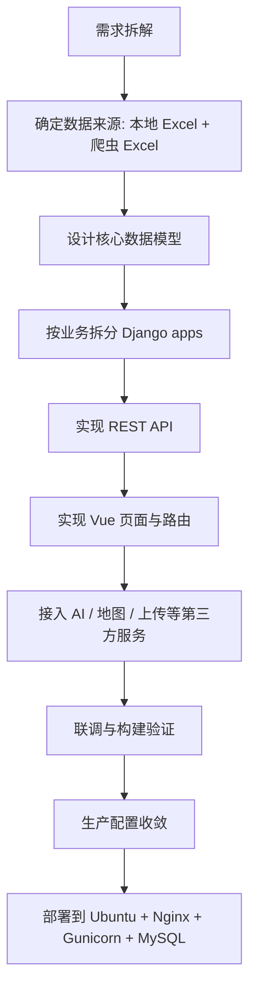
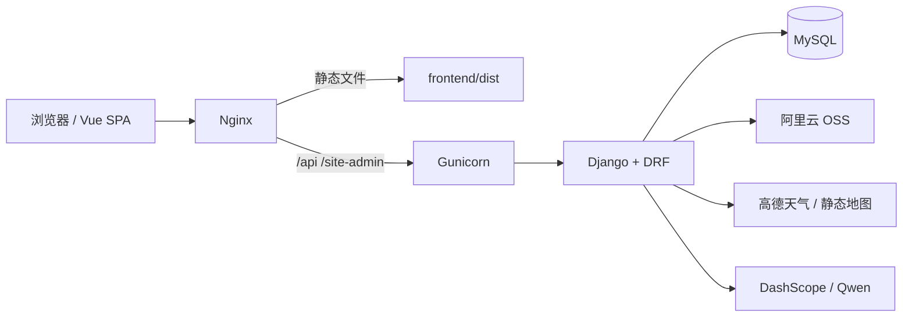
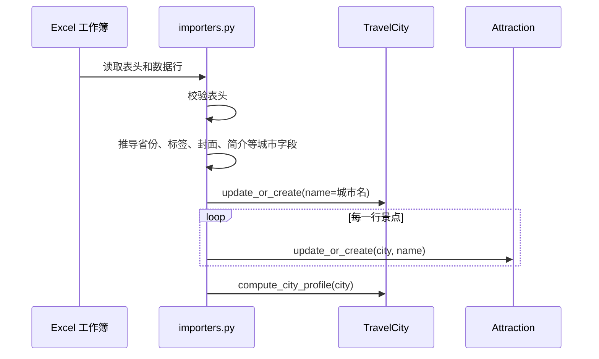
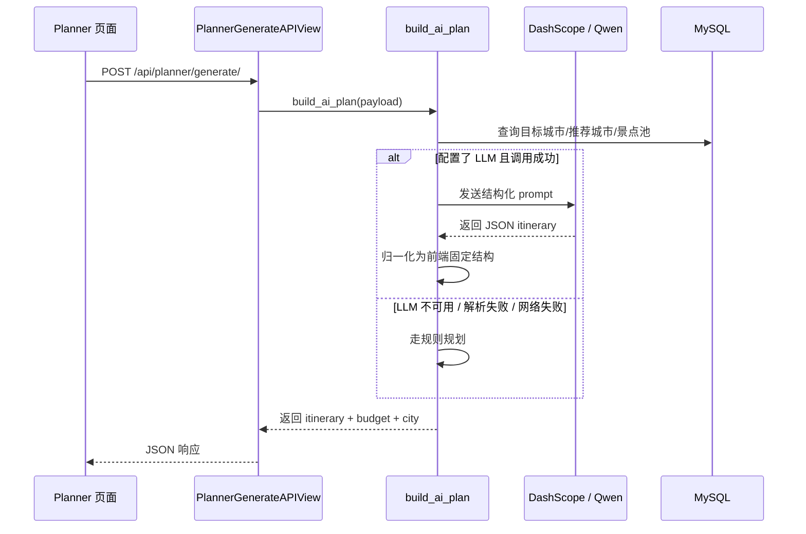
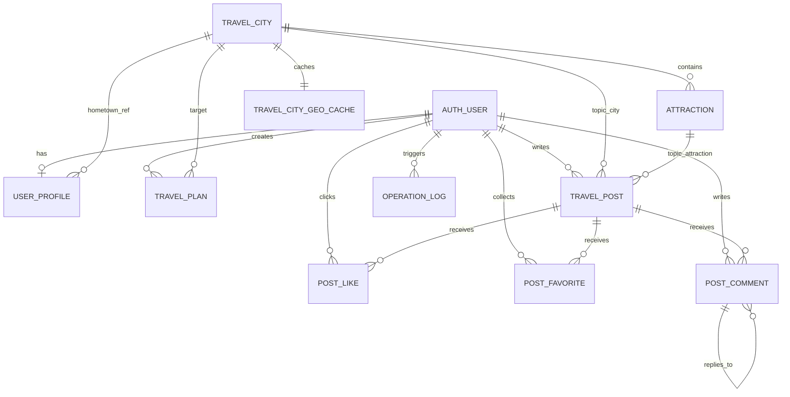

# Smart Travel 项目开发、架构与部署说明

## 1. 项目定位

`smart_travel` 是一个围绕中国城市旅游场景构建的前后端分离项目，目标不是做通用 OTA，而是把一条完整的“数据采集 -> 数据入库 -> 内容展示 -> AI 规划 -> 社区互动 -> 后台管理 -> 线上部署”链路做完整。

当前项目覆盖的核心能力：

- 城市列表、城市详情、景点详情
- AI 行程规划与行程保存
- 旅行社区发帖、点赞、收藏、评论
- 后台数据管理、日志审计、Excel 导入
- 高德天气 / 静态地图
- 阿里云 OSS 上传
- Qwen / DashScope 大模型规划

## 2. 技术栈

| 层 | 技术 |
| --- | --- |
| 前端 | Vue 3、Vue Router、Axios、Vite |
| 后端 | Django 5.1、Django REST Framework、Token Auth |
| 数据库 | MySQL 为主，SQLite 作为回退 |
| 数据导入 | openpyxl、Excel 批量导入 |
| 第三方服务 | DashScope(Qwen)、高德开放平台、阿里云 OSS |
| 部署 | Ubuntu 24.04、Gunicorn、Nginx、systemd |

## 3. 开发流程总览



可以把这个项目理解为 6 个连续阶段：

1. 数据准备：确定 Excel 模板、导入逻辑和爬虫输出格式。
2. 数据建模：先把城市、景点、用户、社区、行程等核心实体建起来。
3. 后端 API：按用户、目的地、规划、社区、后台拆模块。
4. 前端页面：基于统一 API 拼装用户端与后台端界面。
5. 第三方集成：接 OSS、AMap、DashScope。
6. 上线运维：把开发配置收成生产配置，并完成部署。

## 4. 系统架构



设计重点：

- 前端 `axios` 统一把 API 请求发到同域 `/api`
- 生产环境由 Nginx 托管 Vue 构建产物
- Nginx 再把 `/api` 和 `/site-admin` 反代到 Gunicorn
- Django 只负责业务 API 和后台，不直接暴露开发服务器

这也是为什么前端没有写死后端域名，而是用相对路径：

- `frontend/src/services/api.js`
- `frontend/vite.config.js`

## 5. 仓库结构

```text
smart_travel/
├─ backend/
│  ├─ apps/
│  │  ├─ backoffice/
│  │  ├─ community/
│  │  ├─ core/
│  │  ├─ destinations/
│  │  ├─ planner/
│  │  └─ users/
│  ├─ smart_travel/
│  ├─ manage.py
│  └─ requirements.txt
├─ frontend/
│  ├─ public/
│  ├─ src/
│  │  ├─ components/
│  │  ├─ router/
│  │  ├─ services/
│  │  ├─ stores/
│  │  └─ views/
├─ docs/
└─ scripts/
```

## 6. 后端模块拆分思路

### 6.1 为什么模型还挂在 `core` app label 上

这是项目一个很关键的工程决策。

模型代码现在分别写在：

- `apps/destinations/models.py`
- `apps/users/models.py`
- `apps/planner/models.py`
- `apps/community/models.py`
- `apps/backoffice/models.py`

但这些模型都保留了：

```python
CORE_APP_LABEL = "core"
```

并在 `Meta.app_label = CORE_APP_LABEL`。

这样做的目的：

1. 保留历史 MySQL 表名，例如 `core_travelcity`、`core_travelpost`
2. 避免因为“拆 app”而重建数据库
3. 代码分层更清晰，但数据库迁移风险更低

对应的兼容出口在：

- `backend/apps/core/models.py`

它只是把各业务模型重新导出，方便历史导入路径继续可用。

### 6.2 各 app 职责

| app | 作用 |
| --- | --- |
| `core` | 兼容模型导出、审计日志、标签工具、上传工具、权限工具、管理命令 |
| `users` | 注册、登录、登出、个人资料、用户主页、上传接口 |
| `destinations` | 首页概览、城市、景点、Excel 导入、地图天气、城市资料推导 |
| `planner` | AI 行程生成、规则降级、保存行程 |
| `community` | 帖子、点赞、收藏、评论 |
| `backoffice` | 后台统计、用户/城市/景点/帖子管理、操作日志、后台导入 |

## 7. 关键后端实现

### 7.1 配置入口

核心文件：

- `backend/smart_travel/settings.py`
- `backend/smart_travel/urls.py`

重要点：

1. 项目启动时会先读取 `backend/.env`
2. 通过 `DB_ENGINE` 在 MySQL / SQLite 之间切换
3. 通过 `DEBUG`、`ALLOWED_HOSTS`、`CORS_ALLOWED_ORIGINS` 收敛生产配置
4. `/site-admin/` 挂 Django Admin
5. `/api/` 挂各业务模块

### 7.2 用户与认证

核心文件：

- `backend/apps/users/views.py`
- `backend/apps/users/services.py`
- `backend/apps/users/models.py`

这部分实现了：

- `Token` 登录态
- 注册后自动创建 `UserProfile`
- 个人主页的 `home_city` 和 `home_city_ref`
- 上传接口 `/api/uploads/`

设计亮点：

1. `ensure_user_profile()` 保证用户资料是惰性补齐的，而不是依赖一次性初始化。
2. `serialize_user()` 会把主页展示所需的字段一次性打平给前端。

### 7.3 城市 / 景点 / 首页

核心文件：

- `backend/apps/destinations/views.py`
- `backend/apps/destinations/models.py`
- `backend/apps/destinations/home_recommendations.py`
- `backend/apps/destinations/services.py`

这部分负责：

- 首页总览 `/api/overview/`
- 城市列表、城市详情、推荐城市
- 景点列表、景点详情
- 高德天气 `/api/cities/{id}/weather/`
- 高德静态地图 `/api/cities/{id}/static-map/`

首页推荐逻辑不是简单按评分排序，而是结合：

- 城市/景点评分
- 景点数量
- 用户主页中的常住城市
- 用户偏好的旅行风格

### 7.4 Excel 导入

核心文件：

- `backend/apps/destinations/importers.py`
- `backend/apps/core/management/commands/import_city_excels.py`

导入逻辑：



这里最重要的设计是：

1. 城市名默认来自文件名，而不是 Excel 中单独字段
2. `TravelCity` 用 `update_or_create(name=city_name)` 更新
3. `Attraction` 用 `(city, name)` 作为自然主键更新
4. `overwrite=True` 时，当前工作簿就是该城市景点的真相源

### 7.5 AI 行程规划

核心文件：

- `backend/apps/planner/views.py`
- `backend/apps/planner/services.py`
- `backend/apps/planner/models.py`

规划流程：



这里的关键不是“有大模型”，而是“没有大模型也能返回结果”。

`build_ai_plan()` 的策略是：

1. 先找目标城市
2. 找不到就推荐一个最合适的城市
3. 尝试调用 LLM
4. 任一失败都降级到规则规划
5. 如果用户要求保存，再落一份 `TravelPlan`

这让 AI 功能从“可选增强”变成“不会阻断主流程”。

### 7.6 社区模块

核心文件：

- `backend/apps/community/views.py`
- `backend/apps/community/models.py`
- `backend/apps/community/services.py`

实现能力：

- 发帖
- 帖子详情浏览计数
- 点赞切换
- 收藏切换
- 评论与回复

数据库上用两条唯一约束保证重复操作不会产生脏数据：

- `uniq_post_like`
- `uniq_post_favorite`

### 7.7 后台模块

核心文件：

- `backend/apps/backoffice/views.py`
- `backend/apps/backoffice/urls.py`
- `backend/apps/backoffice/models.py`

后台主要承担：

- 统计汇总
- 用户管理
- 城市 / 景点 CRUD
- 帖子管理
- Excel 导入
- 操作日志查询

这里的一个设计重点是：后台不是直接复用用户端页面，而是独立 `layout=admin` 的前端壳层。

### 7.8 操作日志

核心文件：

- `backend/apps/core/activity.py`
- `backend/apps/backoffice/models.py`

`log_operation()` 是很多请求的通用审计入口，记录：

- 用户
- 分类
- 操作名
- 请求路径
- IP
- 操作对象
- 细节 JSON

它既支持 Django 模型实例，也支持上传文件这种临时 dict 对象。

### 7.9 上传与媒体

核心文件：

- `backend/apps/core/media_utils.py`

当前上传链路：

1. 校验扩展名
2. 读取二进制内容
3. 上传到阿里云 OSS
4. 返回签名 URL

这意味着上传功能依赖以下配置：

- `OSS_ACCESS_KEY_ID`
- `OSS_ACCESS_KEY_SECRET`
- `OSS_BUCKET_NAME`
- `OSS_ENDPOINT`

### 7.10 地图与天气缓存

核心文件：

- `backend/apps/destinations/amap.py`
- `backend/apps/destinations/models.py`

`TravelCityGeoCache` 用来缓存高德解析出的：

- 经纬度
- `adcode`
- `citycode`
- 规范地址

作用是避免每次查天气都重新做一次地理编码。

## 8. 前端结构

### 8.1 前端壳层

核心文件：

- `frontend/src/App.vue`

设计要点：

1. 普通用户端和后台端共用一个 Vue 应用
2. 通过路由 `meta.layout === "admin"` 决定切换成后台外壳
3. 登录 / 注册页面使用单独的切换动画

### 8.2 路由

核心文件：

- `frontend/src/router/index.js`

重要路由：

- `/`
- `/cities`
- `/cities/:id`
- `/attractions`
- `/attractions/:id`
- `/planner`
- `/community`
- `/community/:id`
- `/login`
- `/register`
- `/profile`
- `/backoffice`

路由守卫负责：

1. 未登录禁止进入 `/profile`、`/backoffice`
2. 已登录用户不再进入 `/login`、`/register`
3. 非管理员禁止进入后台

### 8.3 API 层

核心文件：

- `frontend/src/services/api.js`
- `frontend/src/stores/auth.js`

关键点：

1. `baseURL` 固定为 `/api`
2. 请求拦截器自动带 `Token xxx`
3. 遇到 `401` 自动清理本地登录态
4. 本地登录态保存在 `localStorage`

## 9. 数据库设计

### 9.1 主要实体

| 实体 | 说明 |
| --- | --- |
| `auth_user` | Django 内置用户表 |
| `UserProfile` | 用户补充资料 |
| `TravelCity` | 城市 / 区域 / 景区 |
| `TravelCityGeoCache` | 高德地理缓存 |
| `Attraction` | 景点 |
| `TravelPlan` | AI 生成并保存的用户行程 |
| `TravelPost` | 社区帖子 |
| `PostLike` | 帖子点赞 |
| `PostFavorite` | 帖子收藏 |
| `PostComment` | 帖子评论与回复 |
| `OperationLog` | 审计日志 |
| `Destination` | 旧版目的地模型，保留兼容 |
| `TripPlan` | 旧版行程模型，保留兼容 |

### 9.2 ER 图



### 9.3 主关系说明

1. 一个用户对应一个 `UserProfile`
2. 一个城市对应多个景点
3. 一个城市最多对应一条地理缓存
4. 一个用户可以保存多个 `TravelPlan`
5. 一个帖子可以关联城市，也可以进一步关联到某个景点
6. 点赞和收藏都通过唯一约束防重
7. 评论支持自关联形成回复树

### 9.4 关键约束

| 约束 | 作用 |
| --- | --- |
| `uniq_attraction_city_name` | 同一城市下景点名唯一 |
| `uniq_post_like` | 同一用户对同一帖子只能点赞一次 |
| `uniq_post_favorite` | 同一用户对同一帖子只能收藏一次 |

## 10. 关键代码入口索引

| 文件 | 作用 | 备注 |
| --- | --- | --- |
| `backend/smart_travel/settings.py` | 环境配置、数据库切换、生产配置 | 项目配置入口 |
| `backend/smart_travel/urls.py` | 全局路由汇总 | API 主入口 |
| `backend/apps/destinations/importers.py` | Excel 导入核心逻辑 | 数据入库最关键 |
| `backend/apps/destinations/home_recommendations.py` | 首页个性化推荐 | 首页算法入口 |
| `backend/apps/destinations/amap.py` | 高德天气和地图缓存 | 第三方集成 |
| `backend/apps/planner/services.py` | AI 行程规划与规则降级 | 规划核心 |
| `backend/apps/community/views.py` | 社区交互行为 | 点赞、评论、收藏 |
| `backend/apps/core/activity.py` | 操作日志审计 | 后台可追溯 |
| `backend/apps/core/media_utils.py` | OSS 上传封装 | 上传能力核心 |
| `frontend/src/router/index.js` | 前端路由与守卫 | 页面访问控制 |
| `frontend/src/services/api.js` | 前端 API 客户端 | 与后端衔接 |
| `scripts/deploy_server.py` | 远程部署脚本 | 线上部署自动化 |

## 11. API 总览

### 11.1 用户与资料

- `POST /api/auth/register/`
- `POST /api/auth/login/`
- `POST /api/auth/logout/`
- `GET /api/auth/me/`
- `GET /api/profile/me/`
- `PATCH /api/profile/me/`
- `POST /api/uploads/`

### 11.2 首页 / 城市 / 景点

- `GET /api/overview/`
- `GET /api/cities/`
- `GET /api/cities/{id}/`
- `GET /api/cities/recommend/`
- `GET /api/cities/{id}/weather/`
- `GET /api/cities/{id}/static-map/`
- `GET /api/attractions/`
- `GET /api/attractions/{id}/`

### 11.3 AI 行程

- `POST /api/planner/generate/`
- `GET /api/plans/`
- `POST /api/plans/`

### 11.4 社区

- `GET /api/posts/`
- `GET /api/posts/{id}/`
- `POST /api/posts/`
- `POST /api/posts/{id}/like/`
- `POST /api/posts/{id}/favorite/`
- `GET /api/posts/favorites/`
- `POST /api/posts/{id}/comment/`

### 11.5 后台

- `GET /api/backoffice/summary/`
- `GET/PUT/DELETE /api/backoffice/users/`
- `GET/POST/PUT/DELETE /api/backoffice/cities/`
- `GET/POST/PUT/DELETE /api/backoffice/attractions/`
- `GET/DELETE /api/backoffice/posts/`
- `GET /api/backoffice/logs/`
- `POST /api/backoffice/import-excels/`
- `POST /api/backoffice/import-excels/upload/`

## 12. 本地开发流程

### 12.1 后端

```powershell
cd backend
python -m venv .venv
.venv\Scripts\activate
pip install -r requirements.txt
python manage.py migrate
python manage.py runserver
```

### 12.2 导入 Excel 数据

```powershell
cd backend
.venv\Scripts\python.exe manage.py import_city_excels --directory "C:/Users/你的目录/cities_data_excel"
```

### 12.3 前端

```powershell
cd frontend
npm install
npm run dev
```

### 12.4 常用校验命令

```powershell
cd backend
.venv\Scripts\python.exe manage.py check
.venv\Scripts\python.exe manage.py makemigrations --check --dry-run

cd ..\frontend
npm run build
```

## 13. 部署说明

### 13.1 生产部署架构

本项目当前生产部署方式：

- 系统：Ubuntu 24.04 64 位
- Web：Nginx
- Python 进程：Gunicorn
- 应用：Django
- 数据库：MySQL
- 进程守护：systemd

线上目录与配置路径：

- 项目目录：`/srv/smart_travel`
- systemd：`/etc/systemd/system/smart_travel.service`
- Nginx 站点：`/etc/nginx/sites-available/smart_travel`
- Nginx 启用链接：`/etc/nginx/sites-enabled/smart_travel`

当前线上访问地址：

- `http://8.137.180.180/`

### 13.2 部署前准备

#### 本地准备

1. 后端依赖安装完成
2. 前端能够 `npm run build`
3. 本地 MySQL 数据正确
4. `backend/.env` 中第三方密钥完整

#### 服务器准备

需要具备：

- `root` 或可 sudo 账户
- 可用公网 IP
- 可安装 `nginx`、`mysql-server`、`python3-venv`

### 13.3 手动部署步骤

#### 第一步：构建前端

```powershell
cd frontend
npm run build
```

#### 第二步：导出本地 MySQL

在 Windows 上推荐这样导出：

```powershell
& 'C:\Program Files\MySQL\MySQL Server 8.0\bin\mysqldump.exe' `
  -uroot -p你的密码 `
  --default-character-set=utf8mb4 `
  --single-transaction `
  --routines `
  --triggers `
  --set-gtid-purged=OFF `
  --result-file=C:\temp\smart_travel.sql `
  smart_travel
```

注意：

- 在 PowerShell 里不要用 `>` 去重定向 mysqldump 输出
- 推荐用 `--result-file`
- 否则可能生成带空字节的 UTF-16 文件，服务器导入时会报错

#### 第三步：准备上传内容

需要上传：

- `backend/`
- `frontend/dist/`
- 数据库备份 `smart_travel.sql`

不应上传：

- `backend/.venv/`
- `frontend/node_modules/`
- `.git/`
- `.idea/`
- 本地 `.env`

#### 第四步：服务器安装依赖

```bash
apt-get update
apt-get install -y nginx mysql-server python3-venv python3-pip
systemctl enable --now mysql nginx
```

#### 第五步：创建项目目录与运行用户

```bash
useradd --system --create-home --shell /bin/bash smarttravel
mkdir -p /srv/smart_travel
```

#### 第六步：恢复数据库

```bash
mysql <<'SQL'
DROP DATABASE IF EXISTS smart_travel;
CREATE DATABASE smart_travel CHARACTER SET utf8mb4 COLLATE utf8mb4_unicode_ci;
CREATE USER IF NOT EXISTS 'smart_travel'@'127.0.0.1' IDENTIFIED BY '你的数据库密码';
CREATE USER IF NOT EXISTS 'smart_travel'@'localhost' IDENTIFIED BY '你的数据库密码';
GRANT ALL PRIVILEGES ON smart_travel.* TO 'smart_travel'@'127.0.0.1';
GRANT ALL PRIVILEGES ON smart_travel.* TO 'smart_travel'@'localhost';
FLUSH PRIVILEGES;
SQL

mysql smart_travel < smart_travel.sql
```

#### 第七步：创建后端虚拟环境并安装依赖

```bash
cd /srv/smart_travel/backend
python3 -m venv .venv
./.venv/bin/pip install --upgrade pip
./.venv/bin/pip install -r requirements.txt
```

#### 第八步：写生产环境变量

服务器 `backend/.env` 至少需要：

```env
SECRET_KEY=生产环境专用密钥
DEBUG=False
ALLOWED_HOSTS=8.137.180.180,127.0.0.1,localhost
CSRF_TRUSTED_ORIGINS=http://8.137.180.180
CORS_ALLOW_ALL_ORIGINS=False
CORS_ALLOWED_ORIGINS=http://8.137.180.180

DB_ENGINE=mysql
DB_NAME=smart_travel
DB_USER=smart_travel
DB_PASSWORD=你的数据库密码
DB_HOST=127.0.0.1
DB_PORT=3306
```

如果项目要完整可用，还需要补：

- `OSS_*`
- `DASHSCOPE_*`
- `AMAP_*`

#### 第九步：迁移与静态文件

```bash
cd /srv/smart_travel/backend
./.venv/bin/python manage.py migrate --noinput
./.venv/bin/python manage.py collectstatic --noinput
./.venv/bin/python manage.py check
```

#### 第十步：配置 Gunicorn(systemd)

`/etc/systemd/system/smart_travel.service`

```ini
[Unit]
Description=Smart Travel Gunicorn
After=network.target mysql.service
Requires=mysql.service

[Service]
User=smarttravel
Group=smarttravel
WorkingDirectory=/srv/smart_travel/backend
ExecStart=/srv/smart_travel/backend/.venv/bin/gunicorn smart_travel.wsgi:application --workers 2 --bind 127.0.0.1:8000 --timeout 120
Restart=always
RestartSec=5

[Install]
WantedBy=multi-user.target
```

启用：

```bash
systemctl daemon-reload
systemctl enable --now smart_travel
```

#### 第十一步：配置 Nginx

`/etc/nginx/sites-available/smart_travel`

```nginx
server {
    listen 80;
    listen [::]:80;
    server_name 8.137.180.180 _;

    root /srv/smart_travel/frontend/dist;
    index index.html;
    client_max_body_size 20M;

    location /static/ {
        alias /srv/smart_travel/backend/staticfiles/;
    }

    location /api/ {
        proxy_pass http://127.0.0.1:8000;
        proxy_set_header Host $host;
        proxy_set_header X-Real-IP $remote_addr;
        proxy_set_header X-Forwarded-For $proxy_add_x_forwarded_for;
        proxy_set_header X-Forwarded-Proto $scheme;
        proxy_read_timeout 120s;
    }

    location /site-admin/ {
        proxy_pass http://127.0.0.1:8000;
        proxy_set_header Host $host;
        proxy_set_header X-Real-IP $remote_addr;
        proxy_set_header X-Forwarded-For $proxy_add_x_forwarded_for;
        proxy_set_header X-Forwarded-Proto $scheme;
        proxy_read_timeout 120s;
    }

    location / {
        try_files $uri $uri/ /index.html;
    }
}
```

启用：

```bash
find /etc/nginx/sites-enabled -maxdepth 1 -type l -name 'default*' -delete
ln -sfn /etc/nginx/sites-available/smart_travel /etc/nginx/sites-enabled/smart_travel
nginx -t
systemctl restart nginx
```

### 13.4 使用脚本部署

项目中已经提供了：

- `scripts/deploy_server.py`

它负责自动完成：

1. 连接服务器
2. 安装依赖
3. 上传应用包与 SQL
4. 创建虚拟环境
5. 重建远程 MySQL
6. 写入生产 `.env`
7. 写入 systemd 与 Nginx 配置
8. 启动服务并验证

脚本调用示意：

```powershell
$env:SMART_TRAVEL_SSH_PASSWORD='你的 SSH 密码'
python scripts\deploy_server.py `
  --host 8.137.180.180 `
  --username root `
  --archive C:\temp\smart_travel_app.tar.gz `
  --dump C:\temp\smart_travel.sql
```

注意：

- 这个脚本会重建远程数据库
- 如果远程已有 `smart_travel` 数据库，会先做一次服务器端备份
- 但它的默认语义仍然是“用本地 dump 覆盖远程数据”

### 13.5 部署后检查

```bash
systemctl status smart_travel
systemctl status nginx
systemctl status mysql

curl -I http://127.0.0.1/
curl -I http://127.0.0.1/site-admin/login/
curl http://127.0.0.1/api/overview/
```

常用运维命令：

```bash
journalctl -u smart_travel -n 200 --no-pager
systemctl restart smart_travel
systemctl restart nginx
```

## 14. 当前工程注意事项

1. 项目保留了 `Destination` 与 `TripPlan` 旧模型，属于兼容数据，不是主流程核心。
2. `TravelCityGeoCache` 已经补入迁移，后续改模型前要先跑：

```powershell
cd backend
.venv\Scripts\python.exe manage.py makemigrations --check --dry-run
```

3. 前端 API 是相对路径 `/api`，生产环境依赖 Nginx 反代，不建议改成硬编码域名。
4. 上传目前走 OSS，如果要改成本地文件上传，需要调整 `apps/core/media_utils.py`。

## 15. 建议的后续维护方式

1. 每次改模型前先看 `app_label = "core"` 的兼容约束。
2. 每次上线前至少执行：
   - `python manage.py check`
   - `python manage.py makemigrations --check --dry-run`
   - `npm run build`
3. 每次部署前保留远程数据库备份。
4. 如果后续接入域名，优先继续沿用 `Nginx + Gunicorn + Django`，只是在 Nginx 层补 HTTPS 即可。
